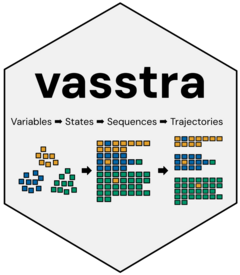

<!-- README.md is generated from README.Rmd. Please edit that file -->

```{r, include = FALSE}
knitr::opts_chunk$set(
  collapse = TRUE,
  comment = "#>",
  fig.path = "man/figures/README-",
  out.width = "100%",
  dpi = 150,
  message = FALSE,
  warning = FALSE
)
```

# VaSSTra 

`VaSSTra` turns longitudinal multivariate data into interpretable states,
sequences, and trajectory groups. The whole analysis is one call, every
part of it is also a simple explicit step, and every automated decision is
reported and recorded.

## Installation

```r
# install.packages("pak")
pak::pak("sonsoleslp/vasstra")
```

Three vignettes ship with the package: `vignette("get-started")` for the
interface, `vignette("vasstra-tutorial")` for a complete worked analysis of
the chapter's longitudinal engagement data, and `vignette("flow-plots")`
for the alluvial and individual flow views.

```{r setup-fit, include = FALSE}
library(VaSSTra)
data("engagement", package = "VaSSTra")

fit <- vasstra(
  engagement,
  state_labels = c("Disengaged", "Average", "Active"),
  state_order  = c("Disengaged", "Average", "Active"),
  state_colors = c(Disengaged = "#D55E00", Average = "#0072B2", Active = "#009E73"),
  dissimilarity = "lcs",
  cluster_method = "ward.D2",
  positive_states = "Active",
  negative_states = "Disengaged"
)
fit <- set_labels(
  fit,
  trajectories = c("Mostly active", "Mostly average", "Mostly disengaged")
)
```

## At a glance

One fit describes each trajectory three ways at once: the transition
network it follows, the individual sequences it groups, and how its state
composition unfolds over time — all on a shared palette and state order.

```{r overview, echo = FALSE, fig.width = 11, fig.height = 7.4, fig.alt = "Per-trajectory grid of transition networks, sequence index plots, and state distributions."}
plot(fit, type = c("transition", "index", "distribution"))
```

## Interactive app

`launch_app()` opens a Shiny application (requires the suggested
`shiny` and `DT` packages) that runs the whole workflow interactively:
load a CSV or the built-in engagement data, map roles, fit with
automated or explicit counts, read the decisions log, walk the state /
sequence / trajectory / evaluation / fit-index tabs, rename groups
after inspecting them, and export every tidy table.

```r
VaSSTra::launch_app()
```

## One call

```r
library(VaSSTra)
data("engagement", package = "VaSSTra")

fit <- vasstra(engagement)
#> Selected n_states = 5 (lpa, bic = 19008.964); ...
#> Selected n_trajectories = 3 (hamming + pam, silhouette = 0.222); ...
```

States are estimated by latent profile analysis (mclust `"EEI"`, tidyLPA
model 1) by default; `state_method` switches to k-means, PAM, or
hierarchical clustering. Automatic selection compares 2 through 6
candidates and never picks a solution whose smallest group holds under
5 percent of the observations.

`vasstra()` finds the subject, time, and indicator roles from attached
role metadata or common column names, compares two through six states and
trajectories, and fits the recommended counts. Three natural shortcuts
cover most analyses:

```r
vasstra(engagement, state_labels = c("Disengaged", "Average", "Active"))
#> three labels, so three states — no n_states needed

vasstra(engagement, n_states = 2:4)
#> compares exactly these candidates and fits the recommended one

vasstra(engagement, n_states = 3)
#> fits exactly three states
```

Name any decision to take it over; automation only fills what you omit:

```r
fit <- vasstra(
  engagement,
  state_labels = c("Disengaged", "Average", "Active"),
  dissimilarity = "lcs",
  cluster_method = "ward.D2",
  positive_states = "Active",
  negative_states = "Disengaged"
)
#> the chapter analysis: three labels imply three LPA profiles
```

The `state_order` argument fixes the order the states read in every plot
when the discovery order does not match, and `state_colors` stores a
palette on the fit so every plot reuses it without repeating `colors`.

Tidy tables are returned directly at the requested analysis unit:

```r
as.data.frame(fit)                              # one row per student
as.data.frame(fit, unit = "observation")        # one row per student-time
as.data.frame(fit, unit = "state_profile")      # one row per state-indicator
as.data.frame(fit, unit = "trajectory")         # one row per trajectory
```

## Understand the states

State results support profile, bar, heatmap, and size plots plus a
combined overview, all without adding a plotting dependency:

```r
plot(fit, which = "states", type = "all")   # profile + bars + heatmap + sizes
plot(fit, which = "states", type = "profile")
plot(fit, which = "states", type = "profile", scale = "original")
```

```{r states, echo = FALSE, fig.width = 9, fig.height = 7.2, fig.alt = "State profile lines, grouped bars, heatmap, and group sizes."}
plot(fit, which = "states", type = "all")
```

## Evaluate the clustering

`evaluate()` compares the fitted counts against the neighboring
candidates and reports per-cluster quality. Plotting draws the selection
curve, per-cluster silhouette widths, and group sizes; the state and
trajectory rows use distinct palettes so they are not read as
corresponding groupings.

```r
evaluation <- evaluate(fit)
evaluation                       # candidate and per-cluster tables
as.data.frame(evaluation)        # one tidy row per compared count
plot(evaluation)                 # selection curve + silhouette + sizes
```

```{r evaluation, echo = FALSE, fig.width = 11, fig.height = 6.4, fig.alt = "Selection curves, silhouette widths, and group sizes for the state and trajectory clusterings."}
plot(evaluate(fit))
```

The same verb evaluates a single step, with any candidate range:

```r
evaluate(fit$states, n_states = 2:5)
evaluate(fit$trajectories)
```

## Tidy fit indices

`fit_indices()` returns the fit statistics of the selected clustering as
one tidy row — for LPA the complete information-criterion family
(log-likelihood, AIC, BIC, SABIC, CAIC, AWE, CLC, KIC, ICL), normalized
entropy, and the minimum and maximum average posterior class
probabilities, plus silhouette and group sizes. `compare = TRUE` gives
one row per candidate with `best` and `fitted` markers. Columns that do
not apply to the fitted method are dropped, so k-means reports its
within-cluster sum of squares instead of likelihood criteria.

```r
fit_indices(fit)                            # the fitted state model
fit_indices(fit, compare = TRUE)            # against all candidate counts
fit_indices(fit, step = "trajectories")     # the trajectory clustering
```

## Relabel anything, tidily

`set_labels()` renames fitted groups after inspection — no refitting, no
touched numbers — and propagates the names through every table, sequence,
and plot, including recorded positive and negative states and any stored
`state_colors`. Use a full vector or rename only some groups by name:

```r
fit <- set_labels(fit, states = c("State 1" = "Disengaged",
                                  "State 2" = "Average",
                                  "State 3" = "Active"))
fit <- set_labels(fit, trajectories = c("Mostly active",
                                        "Mostly average",
                                        "Mostly disengaged"))
states <- set_labels(states, c("Low", "Average", "High"))
```

## Four explicit steps

Each step runs alone with the same automated defaults, and each accepts
the result of the previous step:

```r
states <- step1_states(data)                  # roles and count automated
states <- step1_states(data, n_states = 3,    # or fully explicit
                       labels = c("Low", "Average", "High"))
sequences <- step2_sequences(states)
trajectories <- step3_trajectories(sequences)
description <- step4_describe(
  trajectories,
  positive_states = "High",
  negative_states = "Low"
)
```

Existing states from LPA, LCA, or another method enter directly at
step 2; the state column of a plain data frame is detected or named:

```r
sequences <- step2_sequences(data_with_states, state = "engagement_state")
```

## Compare candidates in full detail

When automation should be replaced by an explicit comparison,
`state_choices()` and `trajectory_choices()` fit a tidy grid across
methods and counts. Nothing is selected silently; fit the inspected
candidate by its id.

```r
state_options <- state_choices(data, n_states = 2:4,
                               method = c("kmeans", "pam", "ward.D2"))
state_options
plot(state_options, metric = "silhouette")
states <- fit_state_choice(state_options)             # the recommendation
states <- fit_state_choice(state_options,             # or say what you want
                           n_states = 3, method = "pam",
                           labels = c("Low", "Average", "High"))

trajectory_options <- trajectory_choices(sequences, n_trajectories = 2:4,
                                         dissimilarity = c("hamming", "lcs"),
                                         method = c("pam", "ward.D2"))
trajectory_options
plot(trajectory_options, metric = "silhouette")
trajectories <- fit_trajectory_choice(trajectory_options,
                                      n_trajectories = 3,
                                      dissimilarity = "lcs",
                                      method = "ward.D2")
```

Average silhouette is the common diagnostic; recommendations maximize it
within each method (LPA candidates use conventional BIC by default via
`lpa_criterion`), subject to the requested group-size constraints.

## Sequence views

Every plot containing state sequences is rendered by `Nestimate`:

```r
plot(fit, which = "sequences")            # heatmap of every aligned sequence
plot(fit, which = "sequences", type = "distribution")
plot(fit, type = "index")                 # one panel per trajectory
plot(fit, type = "distribution")
```

```{r sequences, echo = FALSE, fig.width = 10, fig.height = 5.6, fig.alt = "State distribution over time for each trajectory."}
plot(fit, type = "distribution")
```

## Flow plots

Sequence plots are organised by subject similarity, so they show who
resembles whom but not where movement goes — and a flat state distribution
cannot distinguish a cohort where nobody moves from one where everybody
swaps. `flow_plot()` draws the movement itself, rendered by
[`cograph`](https://github.com/mohsaqr/cograph) (a suggested package), on
the same palette and state order as every other VaSSTra plot:

```r
flow_plot(fit)                              # aggregated alluvial bands
flow_plot(fit, type = "individual")         # one line per subject
flow_plot(fit, color_by = "destination")    # colour bands by where they arrive
flow_plot(fit, group = "Mostly average")    # one trajectory's flows
```

```{r flow, echo = FALSE, fig.width = 9, fig.height = 5.2, fig.alt = "Alluvial flow of subjects between states across time points."}
flow_plot(fit)
```

Individual flows are bundled automatically so large cohorts stay legible
(`bundle = FALSE` draws every subject). Unlike the base-graphics `plot()`
methods, `flow_plot()` returns a `ggplot` object.

## Transition networks

`transition_plot()` collapses every time step into one network: states are
nodes, transitions are directed edges, and node size is a centrality of the
transition network. `Nestimate` builds the network and the centralities
(`build_tna()`, `net_centrality()`), and `cograph::splot()` draws it —
recognising the network object and supplying TNA styling, labels, and
initial-probability rings on its own. The default node size is in-strength,
so the largest node is the state the cohort most often moves *into*.

```r
transition_plot(fit)                                    # size = in-strength
transition_plot(fit, weights = "count")                 # raw counts
transition_plot(fit, size = "OutStrength")              # any Nestimate measure
transition_plot(fit, loops = TRUE)                      # count self-transitions
transition_plot(fit, group = "Mostly disengaged")       # one trajectory
transition_plot(fit, sequences = TRUE)                  # sequences + network
```

```{r transition, echo = FALSE, fig.width = 6.5, fig.height = 5.4, fig.alt = "State transition network with node size by in-strength."}
transition_plot(fit)
```

`sequences = TRUE` draws the state sequences beside the network — the
conventional pairing, where the left panel shows the raw data and the right
summarises its movement. Both panels share one palette, so a state has the
same colour in each; `"heatmap"` and `"distribution"` select the left view.

The same centralities come as a tidy table, without drawing anything:

```r
transition_centrality(fit)                     # in- and out-strength
transition_centrality(fit, measures = "all")   # every Nestimate measure
transition_centrality(fit, weights = "count")
```

Self-transitions are excluded from the centrality by default, matching
`Nestimate::net_centrality()` and `tna::centralities()` — otherwise a
persistent state looks large merely because its members stay put, which is
a different claim from attracting movement. See `vignette("flow-plots")`.

## Dependencies

`mclust` powers the default LPA state estimation, base R provides
k-means and hierarchical clustering, `cluster` provides PAM, and
`Nestimate` provides sequence distances, trajectory clustering, and all
sequence plots. `cograph` is suggested, not required, and renders the flow
plots. There is no TraMineR plotting path or dependency.

Method overview: [VaSSTra chapter](https://lamethods.org/book1/chapters/ch11-vasstra/ch11-vasstra.html).
