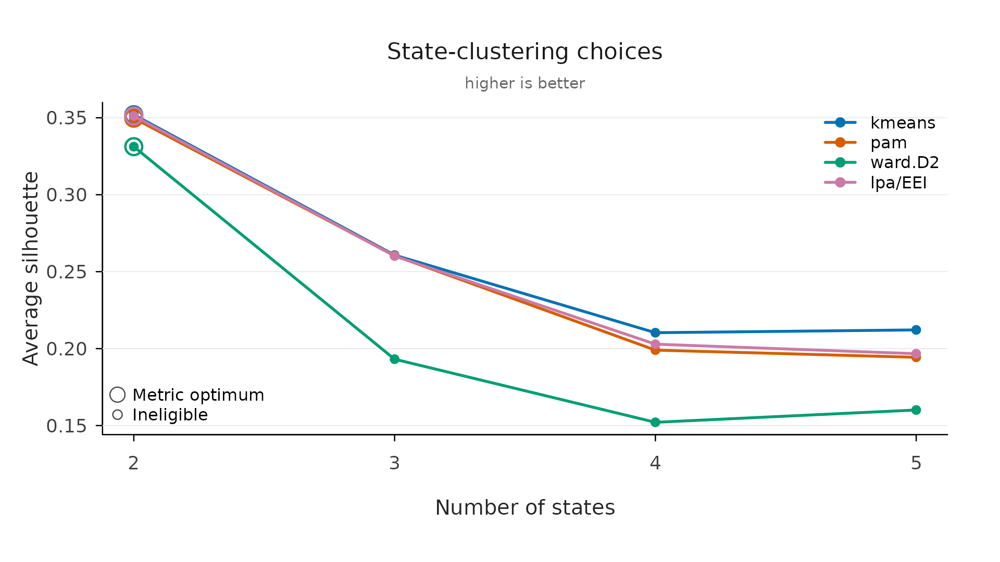

# Clustering Algorithms in VaSSTra

VaSSTra clusters **twice**, and they are different problems that call
for different algorithms:

1.  **States** (step 1) group *multivariate observations* — one student
    at one time point, described by several indicators — into a small
    set of interpretable profiles.
2.  **Trajectories** (step 3) group *whole sequences* — one student’s
    ordered string of states over time — into groups of similar
    journeys.

The first is ordinary multivariate clustering on a numeric matrix; the
second is clustering on a matrix of pairwise *sequence distances*. This
article explains the algorithms VaSSTra offers for each, when to reach
for them, and how the automated selection chooses.

## States: from indicators to profiles

[`step1_states()`](https://sonsoles.me/vasstra/reference/step1_states.md)
(and `vasstra(..., variables = )`) turns the standardized indicator
matrix into `n_states` profiles. The `state_method` argument picks the
algorithm; states are then ordered from the lowest to the highest
average standardized profile, so the labels read low-to-high.

### Latent profile analysis (the default)

`method = "lpa"` fits a **Gaussian finite mixture model** with `mclust`:
each state is a multivariate Gaussian, and every observation gets a
*posterior probability* of belonging to each state rather than a hard
assignment. `lpa_model` selects the covariance structure; the default
`"EEI"` (equal variances, zero covariances — tidyLPA model 1) is
diagonal and equal across states, the most parsimonious choice. Because
it is a probability model, the number of states can be compared by
**BIC**, and classification quality by entropy and the posterior
probabilities
([`fit_indices()`](https://sonsoles.me/vasstra/reference/fit_indices.md)).

*Use it when* the indicators are roughly continuous and you want a
model-based solution with soft assignments and information criteria —
the common default in learning-analytics profile work.

``` r

fit <- vasstra(
  engagement,
  state_labels = c("Disengaged", "Average", "Active"),
  state_method = "lpa",
  lpa_model = "EEI"
)
#> Using n_states = 3 to match the supplied labels.
#> Selected n_trajectories = 3 (hamming + pam, silhouette = 0.435); see `diagnostics$selection`.
fit_indices(fit)[, c("n_states", "log_likelihood", "bic", "entropy", "prob_min")]
#>  n_states log_likelihood      bic entropy prob_min
#>         3       -9940.47 20120.13   0.894    0.945
```

### k-means

`method = "kmeans"` minimises the total within-cluster sum of squared
Euclidean distances to cluster centroids (Hartigan–Wong). It is fast and
familiar, gives hard assignments, and assumes roughly spherical,
equal-spread clusters. It has no likelihood, so counts are compared by
silhouette rather than BIC.

*Use it when* you want a quick, hard, centroid-based partition and the
profiles are compact and similarly sized.

### Partitioning around medoids (PAM)

`method = "pam"` (from `cluster`) is the medoid analogue of k-means:
each cluster is represented by an actual observation (its medoid), and
the algorithm minimises total distance to medoids. It is more robust to
outliers than k-means and works from pairwise distances (here Euclidean
on the standardized indicators).

*Use it when* you want k-means-style partitions but with more resistance
to outliers, or a representative real profile per state.

### Hierarchical clustering

`method` also accepts the agglomerative linkages `"ward.D2"`,
`"ward.D"`, `"complete"`, `"average"`, `"single"`, `"mcquitty"`,
`"median"`, and `"centroid"` (base R `hclust`), cut at `n_states`.
**Ward** minimises the increase in within-cluster variance at each merge
and tends to give compact, balanced clusters; **complete** and
**average** control the between-cluster linkage differently; **single**
chains and is rarely what you want for profiles.

*Use it when* you want a dendrogram / nested structure, or a
deterministic linkage rule; `ward.D2` is the usual first choice.

### What automation does

Under `n_states = "auto"`, VaSSTra compares two through six states and
selects a recommendation — by **BIC** for LPA, by **average silhouette**
for the hard methods — and never selects a solution whose smallest class
holds under **5%** of observations (the conventional threshold below
which a latent class is treated as spurious). Supplying `state_labels`
fixes the count directly.

## Trajectories: from sequences to groups

[`step3_trajectories()`](https://sonsoles.me/vasstra/reference/step3_trajectories.md)
(and [`vasstra()`](https://sonsoles.me/vasstra/reference/vasstra.md)’s
trajectory step) clusters the *aligned state sequences*. This is a
two-ingredient recipe: a **sequence dissimilarity** turns every pair of
sequences into a distance, and a **clustering method** groups the
resulting distance matrix. Both are chosen explicitly.

### Sequence dissimilarities

`dissimilarity` selects how two sequences are compared — they capture
genuinely different notions of “different”, so the choice is
substantive, not cosmetic:

| Distance | What it counts | Good when |
|----|----|----|
| `hamming` | Position-by-position mismatches on the aligned grid | Timing matters: being in a different state *at the same moment* is what separates journeys |
| `osa`, `lv`, `dl` | Edit distances — insertions, deletions, substitutions (and transpositions for `osa`/`dl`) to turn one sequence into the other | Shape matters more than exact timing; small shifts should cost little |
| `lcs` | Length of the longest common subsequence (the chapter’s default) | Shared *ordered* sub-patterns matter, regardless of gaps between them |
| `qgram` | Overlap of length-*q* substrings | Local motifs (short recurring patterns) matter |
| `cosine`, `jaccard` | Token-set overlap, ignoring order | Only the *composition* of states visited matters, not their order |
| `jw` | Jaro–Winkler string similarity | Prefix agreement is important |

`hamming` and `lcs` sit at the two ends most analyses use: *when*
students are in each state versus *what ordered pattern* they follow.
The chapter analysis uses `lcs`. Studer and Ritschard (2015) review how
these measures differ and what each one privileges.

### Clustering the distance matrix

`method` groups the distances: `"pam"` (medoids, robust, a
representative sequence per group), the agglomerative linkages
`"ward.D2"` / `"ward.D"` / `"complete"` / `"average"` / `"single"` /
`"mcquitty"` / `"median"` / `"centroid"`, cut at `n_trajectories`. As
with states, **Ward** favours compact balanced groups and **PAM**
favours robustness; `ward.D2` with `lcs` reproduces the worked chapter
analysis.

``` r

fit <- vasstra(
  engagement,
  state_labels = c("Disengaged", "Average", "Active"),
  dissimilarity = "lcs",
  cluster_method = "ward.D2"
)
#> Using n_states = 3 to match the supplied labels.
#> Selected n_trajectories = 3 (lcs + ward.D2, silhouette = 0.514); see `diagnostics$selection`.
fit$diagnostics$n_trajectories
#> [1] 3
```

### Backend

`backend = "Nestimate"` (default) computes the distances and clustering
through
\[[`Nestimate::build_clusters()`](https://saqr.me/Nestimate/reference/build_clusters.html)\],
which supports every distance and method above. `backend = "base"` is a
dependency-free fallback that supports only `hamming` and `lcs`
distances — useful for a minimal install.

## Choosing among the candidates

Two verbs make the comparison explicit rather than automatic.
[`state_choices()`](https://sonsoles.me/vasstra/reference/state_choices.md)
and
[`trajectory_choices()`](https://sonsoles.me/vasstra/reference/trajectory_choices.md)
fit a full grid of methods and counts and return one tidy row per
candidate, with the recommendation marked within each method —
**silhouette** for the hard clusterings and **BIC** for LPA (model-based
criteria only compare within LPA). Nothing is selected silently; you fit
the inspected candidate by its id.

``` r

state_options <- state_choices(
  engagement,
  n_states = 2:5,
  method = c("kmeans", "pam", "ward.D2", "lpa")
)
plot(state_options, metric = "silhouette")
```



Average **silhouette width** (Rousseeuw, 1987) is the shared diagnostic:
for each unit it contrasts its average distance to its own group against
the nearest other group, so higher is better-separated. **BIC**
(Schwarz, 1978) trades model fit against the number of parameters and is
only meaningful for the likelihood-based LPA.
[`evaluate()`](https://sonsoles.me/vasstra/reference/evaluate.md) and
`plot(evaluate(fit))` show the same silhouette on the same scale, so the
method comparison here and the count comparison there compose into one
argument.

## When to use what — a short guide

- **Continuous indicators, want soft assignments and information
  criteria** → LPA (default). Compare counts by BIC; check entropy and
  `prob_min`.
- **Quick hard partition, compact profiles** → k-means.
- **Robustness to outliers / a representative profile** → PAM.
- **Want a dendrogram or a deterministic rule** → hierarchical
  `ward.D2`.
- **Trajectories where timing separates students** →
  `dissimilarity = "hamming"`.
- **Trajectories where the ordered pattern separates students** →
  `dissimilarity = "lcs"` (the chapter default), with `ward.D2` or
  `pam`.
- **Unsure** → run
  [`state_choices()`](https://sonsoles.me/vasstra/reference/state_choices.md)
  /
  [`trajectory_choices()`](https://sonsoles.me/vasstra/reference/trajectory_choices.md)
  across a few methods and let the silhouette (and BIC, for LPA) guide
  you.

## References

The algorithms live in the packages VaSSTra builds on; these are their
canonical citations (from
[`citation()`](https://rdrr.io/r/utils/citation.html)) and the method
references given in their help pages.

**Packages**

- Scrucca, L., Fraley, C., Murphy, T. B., & Raftery, A. E. (2023).
  *Model-Based Clustering, Classification, and Density Estimation Using
  mclust in R.* Chapman & Hall/CRC. `citation("mclust")`. LPA state
  estimation. See also Scrucca, L., Fop, M., Murphy, T. B., &
  Raftery, A. E. (2016). *mclust 5: Clustering, Classification and
  Density Estimation Using Gaussian Finite Mixture Models.* The R
  Journal, 8(1), 289–317. <doi:10.32614/RJ-2016-021>.
- Maechler, M., Rousseeuw, P., Struyf, A., Hubert, M., & Hornik, K.
  *cluster: Cluster Analysis Basics and Extensions.* R package.
  `citation("cluster")`. PAM and silhouette.
- Saqr, M., López-Pernas, S., & Misiejuk, K. *Nestimate: Network
  Estimation, Bootstrap, and Higher-Order Analysis.* R package.
  `citation("Nestimate")`. Sequence distances and trajectory clustering.
- van der Loo, M. (2026). *stringdist: Approximate String Matching,
  Fuzzy Text Search, and String Distance Functions.* R package.
  <https://CRAN.R-project.org/package=stringdist>. The definitions the
  sequence dissimilarities follow (`osa`, `lv`, `dl`, `qgram`, `cosine`,
  `jaccard`, `jw`).
- Rosenberg, J., Beymer, P., Anderson, D., van Lissa, C. J., &
  Schmidt, J. (2018). *tidyLPA: An R package to easily carry out latent
  profile analysis (LPA) using open-source or commercial software.*
  Journal of Open Source Software, 3(30), 978.
  <doi:10.21105/joss.00978>. The “model 1” naming for the `"EEI"`
  covariance structure.
- R Core Team. *R: A Language and Environment for Statistical
  Computing.* R Foundation for Statistical Computing.
  [`citation()`](https://rdrr.io/r/utils/citation.html). k-means
  (`kmeans`) and hierarchical clustering (`hclust`).

**Methods**

- Hartigan, J. A., & Wong, M. A. (1979). *Algorithm AS 136: A k-means
  clustering algorithm*
  ([`?kmeans`](https://rdrr.io/r/stats/kmeans.html)).
- Ward, J. H. (1963), with the `ward.D2` implementation of Murtagh, F.,
  & Legendre, P. (2014), *Ward’s hierarchical clustering method*,
  <doi:10.1007/s00357-014-9161-z>
  ([`?hclust`](https://rdrr.io/r/stats/hclust.html)).
- Kaufman, L., & Rousseeuw, P. J. (1990). *Finding Groups in Data: An
  Introduction to Cluster Analysis* — PAM (`?pam`).
- Rousseeuw, P. J. (1987). *Silhouettes: a graphical aid to the
  interpretation and validation of cluster analysis.* J. Comput. Appl.
  Math. (`?silhouette`).
- Schwarz, G. (1978). *Estimating the Dimension of a Model.* Annals of
  Statistics, 6(2), 461–464. <doi:10.1214/aos/1176344136>. BIC.
- Studer, M., & Ritschard, G. (2015). *What Matters in Differences
  Between Life Trajectories: A Comparative Review of Sequence
  Dissimilarity Measures.* Journal of the Royal Statistical Society,
  Series A, 179(2), 481–511. <doi:10.1111/rssa.12125>. On choosing a
  sequence distance.

Method overview and the substantive analysis: [VaSSTra
chapter](https://lamethods.org/book1/chapters/ch11-vasstra/ch11-vasstra.html)
of *Learning Analytics Methods and Tutorials*.
