# Flow Plots

A state distribution that stays flat across time is ambiguous evidence.
It is equally consistent with a cohort in which nobody moves and a
cohort in which everybody swaps places, because both leave the same
number of students in each state at each moment. The engagement data
turn out to be the second kind: the share of disengaged students stays
between a fifth and a quarter of the cohort at every one of the eight
course positions, yet almost a third of consecutive observations are a
change of state. Nothing in a distribution plot, and nothing in a
sequence plot sorted by similarity, separates those two worlds.

[`flow_plot()`](https://sonsoles.me/vasstra/reference/flow_plot.md)
closes that gap. It draws the movement itself — how many students leave
each state, and which state they arrive in — using
[cograph](https://github.com/mohsaqr/cograph) for the rendering, and
[`transition_plot()`](https://sonsoles.me/vasstra/reference/transition_plot.md)
collapses the same movement into a network whose node sizes come from
`Nestimate`’s transition-network centralities. This vignette is the
third in the series:
[`vignette("get-started")`](https://sonsoles.me/vasstra/articles/get-started.md)
covers the interface,
[`vignette("vasstra-tutorial")`](https://sonsoles.me/vasstra/articles/vasstra-tutorial.md)
runs the complete analysis, and this one covers the views that answer
*where movement goes*, in this order:

1.  Why flows need their own view.
2.  Aggregated flows: the alluvial.
3.  Individual flows: one line per student.
4.  Flows inside a single trajectory.
5.  Controlling colour, bundling, and layout.
6.  The transition network: movement collapsed over time.

| Question | View |
|----|----|
| What is the mix at each time? | `plot(fit, which = "sequences", type = "distribution")` |
| Who resembles whom? | `plot(fit, which = "sequences")` (heatmap) |
| Where does movement go? | `flow_plot(fit)` |
| Which students move where? | `flow_plot(fit, type = "individual")` |
| How does one trajectory move? | `flow_plot(fit, group = ...)` |
| Which states attract movement overall? | `transition_plot(fit)` |
| The same, as numbers | `transition_centrality(fit)` |

``` r

library(VaSSTra)
data("engagement", package = "VaSSTra")

fit <- vasstra(
  engagement,
  state_labels = c("Disengaged", "Average", "Active"),
  dissimilarity = "lcs",
  cluster_method = "ward.D2",
  trajectory_labels = c(
    "Mostly active",
    "Mostly average",
    "Mostly disengaged"
  ),
  positive_states = "Active",
  negative_states = "Disengaged"
)
#> Using n_states = 3 to match the supplied labels.
#> Using n_trajectories = 3 to match the supplied labels.
#> Registered S3 method overwritten by 'Nestimate':
#>   method     from   
#>   print.mcml cograph
```

## 1. Why flows need their own view

The transition table is the numeric form of the same information, and it
already shows why the flat distribution is misleading.

``` r

summary(fit$sequences)
#>    position time      state count proportion
#> 1         1    1 Disengaged    35  0.2464789
#> 2         2    2 Disengaged    35  0.2464789
#> 3         3    3 Disengaged    36  0.2535211
#> 4         4    4 Disengaged    27  0.1901408
#> 5         5    5 Disengaged    31  0.2183099
#> 6         6    6 Disengaged    35  0.2464789
#> 7         7    7 Disengaged    35  0.2464789
#> 8         8    8 Disengaged    32  0.2253521
#> 9         1    1    Average    70  0.4929577
#> 10        2    2    Average    62  0.4366197
#> 11        3    3    Average    67  0.4718310
#> 12        4    4    Average    78  0.5492958
#> 13        5    5    Average    70  0.4929577
#> 14        6    6    Average    69  0.4859155
#> 15        7    7    Average    64  0.4507042
#> 16        8    8    Average    71  0.5000000
#> 17        1    1     Active    37  0.2605634
#> 18        2    2     Active    45  0.3169014
#> 19        3    3     Active    39  0.2746479
#> 20        4    4     Active    37  0.2605634
#> 21        5    5     Active    41  0.2887324
#> 22        6    6     Active    38  0.2676056
#> 23        7    7     Active    43  0.3028169
#> 24        8    8     Active    39  0.2746479
fit$sequences$transitions
#>         from         to count probability
#> 1 Disengaged Disengaged   156 0.666666667
#> 2    Average Disengaged    73 0.152083333
#> 3     Active Disengaged     2 0.007142857
#> 4 Disengaged    Average    73 0.311965812
#> 5    Average    Average   335 0.697916667
#> 6     Active    Average    73 0.260714286
#> 7 Disengaged     Active     5 0.021367521
#> 8    Average     Active    72 0.150000000
#> 9     Active     Active   205 0.732142857
```

Two facts drive everything below. First, persistence is high but far
from total: 696 of the 994 consecutive pairs stay put, so 30 percent are
moves. A distribution plot renders those 298 moves as a flat band,
because they cancel — 73 students leave Disengaged for Average while 73
travel the other way, and 72 move up from Average to Active against 73
coming back down. The composition is stable precisely *because* the
exchange is balanced, which is a different claim from stability and has
different consequences for anyone designing an intervention.

Second, the corners of the table are nearly empty. Only 5 of 994
transitions run from Disengaged straight to Active, and only 2 run the
other way. Movement between the extremes essentially always passes
through Average, which makes the middle state a waypoint rather than
merely an intermediate label. That is a structural claim about the state
system, and it is the kind of thing the eye reads instantly from a flow
diagram and slowly from a nine-row table.

## 2. Aggregated flows: the alluvial

[`flow_plot()`](https://sonsoles.me/vasstra/reference/flow_plot.md)
draws one band per transition, with band width proportional to the
number of students making it, at every consecutive pair of time points
at once.

``` r

flow_plot(fit)
```

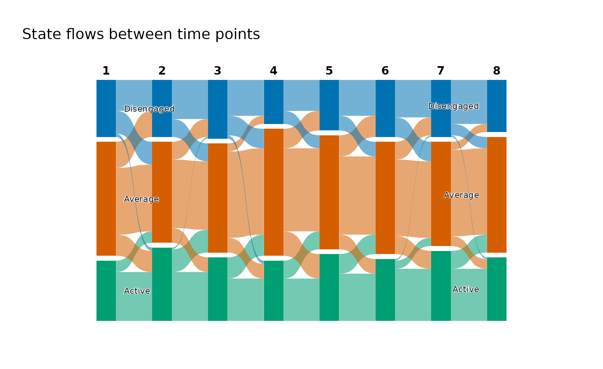

The near-absent corner transitions appear as the missing bands: only
hair-thin threads cross the full height of the figure between the top
block and the bottom one, against the substantial ribbons joining each
block to its neighbour. The balanced exchange appears as the criss-cross
between neighbouring states, which is thick in both directions at every
step and leaves the block heights almost unchanged from column to
column. Read together with the transition table, the picture supplies
the shape and the table supplies the counts.

Bands are coloured by the state they leave, which is what makes the
outflow of a single state followable across the whole figure. Colouring
by destination answers the mirrored question — which state a given block
recruits from — and is one argument away.

``` r

flow_plot(fit, color_by = "destination")
```

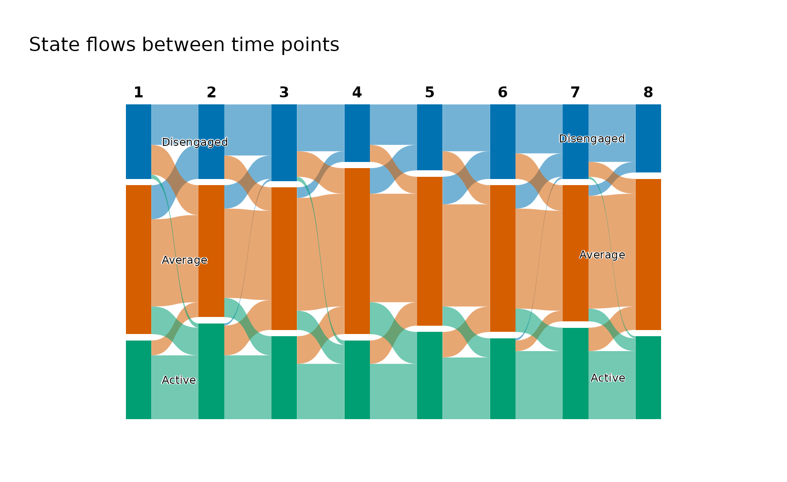

The colours, the state order, and the time labels come from the fit, so
this figure and the sequence heatmap from the tutorial can be placed
side by side without re-reading a legend.

## 3. Individual flows: one line per student

Aggregated bands merge students who move together. The individual view
keeps them apart, drawing one line per student coloured by the state
they started in, which turns the question from *how much flow* into
*whose*.

``` r

flow_plot(fit, type = "individual")
```

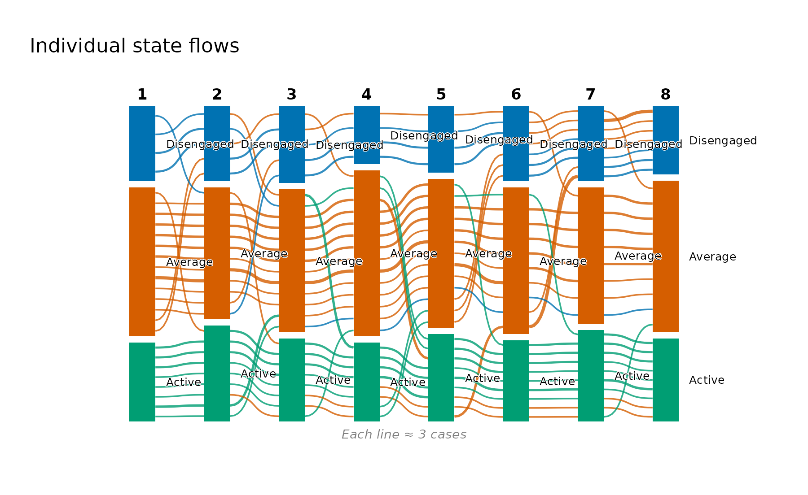

Colouring by first state makes early position followable to the end: the
green lines beginning in Active stay largely within the lower band,
while the orange lines that begin in Average are the ones ranging across
the full height of the figure. This is the visual counterpart of the
trajectory description’s mobility columns — the Average-heavy group
records 2.33 transitions per student against 1.83 and 1.89 for the two
extreme groups, and here that difference is the visible fanning of the
orange lines.

With 142 students the lines would overplot, so
[`flow_plot()`](https://sonsoles.me/vasstra/reference/flow_plot.md)
bundles them by default and annotates the figure with how many students
one line represents. Setting `bundle = FALSE` draws every student, which
is worth doing for small cohorts and rarely worth doing for large ones.

``` r

flow_plot(fit, type = "individual", color_by = "last")
```

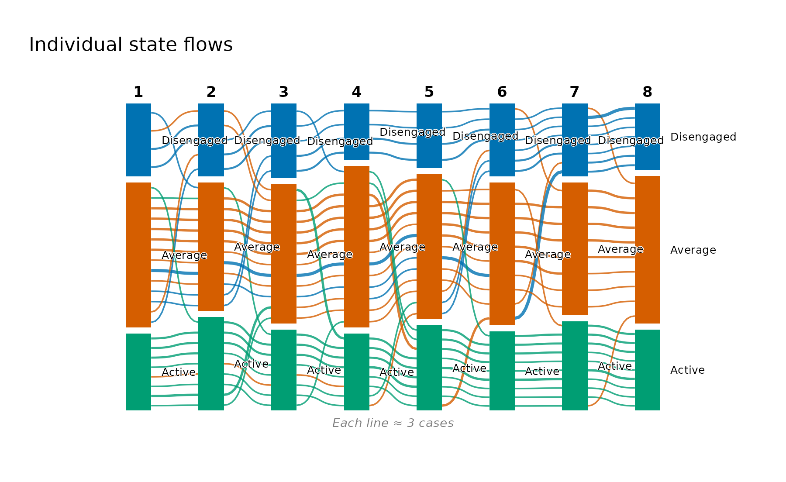

Colouring by the *final* state instead reverses the reading: it traces
where each of today’s groups came from, which is the useful direction
when the outcome is known and the question is what preceded it.

## 4. Flows inside a single trajectory

The trajectories are defined by whole-sequence similarity, so the
natural follow-up is whether a trajectory is internally uniform or
merely averages to its label. Flow diagrams draw a single panel and
cannot be faceted, so `group` restricts the plot to one trajectory’s
students.

``` r

flow_plot(fit, group = "Mostly average", type = "individual")
```

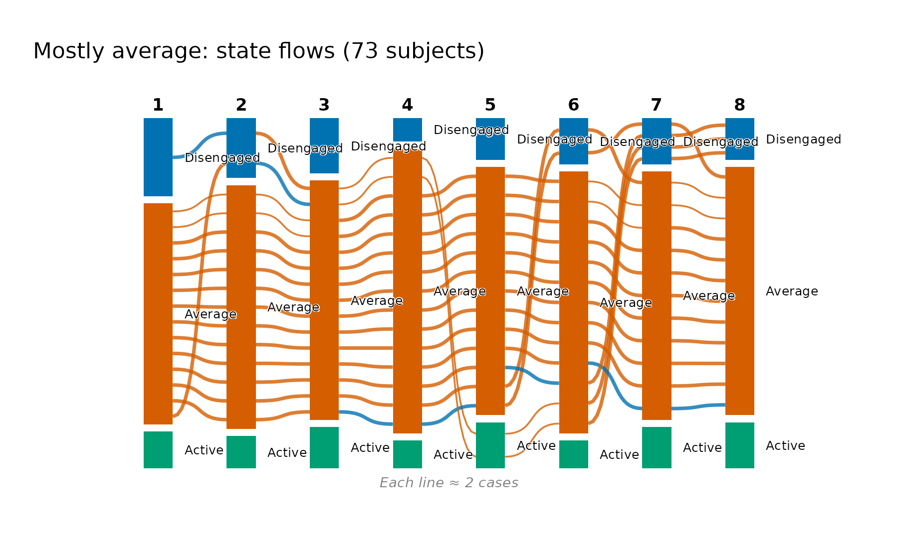

The label survives the check: the group is overwhelmingly a single
orange band, with a thin blue thread of excursions into Disengaged and a
small Active block that never grows. Its mean within-trajectory distance
is the largest of the three (4.96 against 4.26 and 3.86), and this is
what that looseness looks like — not a mixture of different journeys,
but one journey with the most frequent small departures from it.

``` r

flow_plot(fit, group = "Mostly disengaged")
```

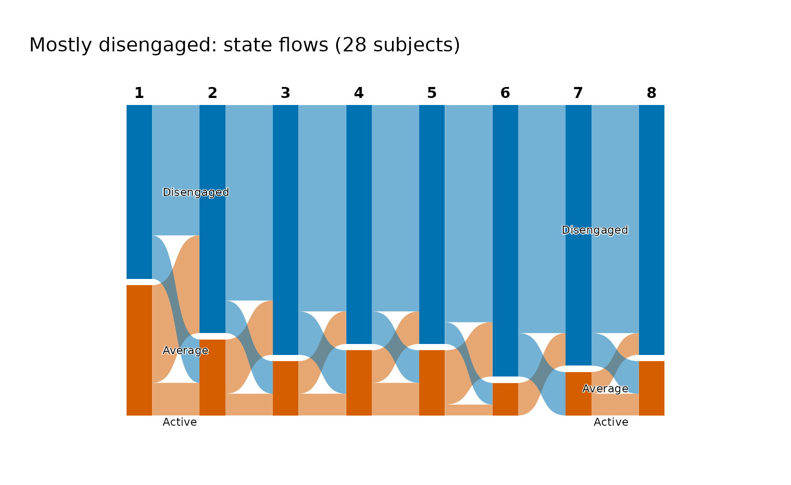

The most disengaged group is the tightest, and its aggregated flows show
why: the Disengaged block absorbs nearly everything at every step, with
its negative exposure of 0.82 and integrative potential of exactly zero
meaning no student in this group is in the Active state at the end. The
contrast with the previous figure is the substantive result — these
trajectories differ in their movement, not only in their average level.

``` r

as.data.frame(fit, unit = "trajectory")
#>          trajectory  n proportion mean_within_distance n_observed unique_states
#> 1     Mostly active 41  0.2887324             4.258537          8      1.878049
#> 2    Mostly average 73  0.5140845             4.961187          8      1.986301
#> 3 Mostly disengaged 28  0.1971831             3.857143          8      1.821429
#>   transitions   entropy complexity volatility integrative_potential
#> 1    1.829268 0.4189906  0.3251220  0.4436702             0.7696477
#> 2    2.328767 0.4736884  0.3865300  0.4973907             0.1149163
#> 3    1.892857 0.3978570  0.3246998  0.4387755             0.0000000
#>   negative_exposure
#> 1       0.009485095
#> 2       0.131659056
#> 3       0.820436508
```

## 5. Controlling colour, bundling, and layout

[`flow_plot()`](https://sonsoles.me/vasstra/reference/flow_plot.md) sets
the palette, the state order, the time labels, and a readable geometry,
and passes anything else through to cograph, so a figure destined for a
manuscript can be tuned without abandoning the wrapper.

``` r

flow_plot(
  fit,
  main = "Engagement flows across eight course positions",
  colors = c("#B3B3B3", "#4C9BE8", "#0B5394"),
  flow_alpha = 0.75,
  threshold = 3
)
```

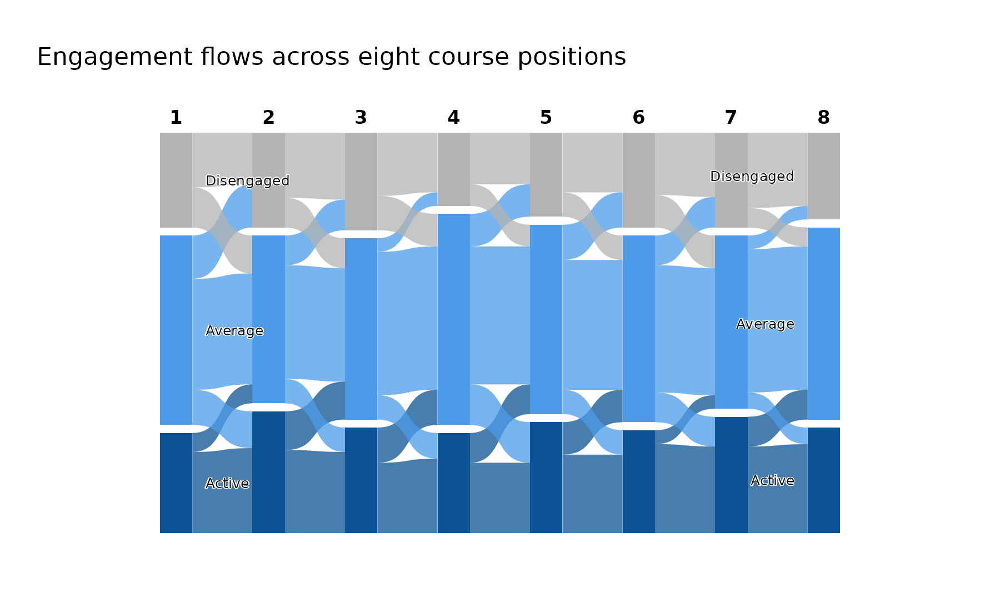

`colors` takes one colour per state in state order and applies to
everything the figure draws, so a custom palette stays consistent
between nodes and bands — here an ordered grey-to-navy ramp, which suits
an ordered state system better than the categorical default.

`threshold` suppresses flows below a given number of students, and this
data set makes the choice unusually easy to defend. Counted step by
step, the corner transitions between Disengaged and Active never exceed
two students, while the smallest transition between neighbouring states
is five. A threshold of three therefore removes every corner transition
and retains every neighbouring one, which is why the criss-cross
survives intact above while the hair-thin diagonals are gone. Thresholds
chosen without that check will quietly delete real movement, so it is
worth reading the transition table before setting one.

Two arguments are specific to the individual view. `bundle` sets how
many students one line represents — `"auto"` by default, `FALSE` for
every student, or a number — and `bundle_max` sets the number of lines
above which automatic bundling starts (50 by default).

``` r

flow_plot(
  fit,
  group = "Mostly disengaged",
  type = "individual",
  bundle = FALSE
)
```

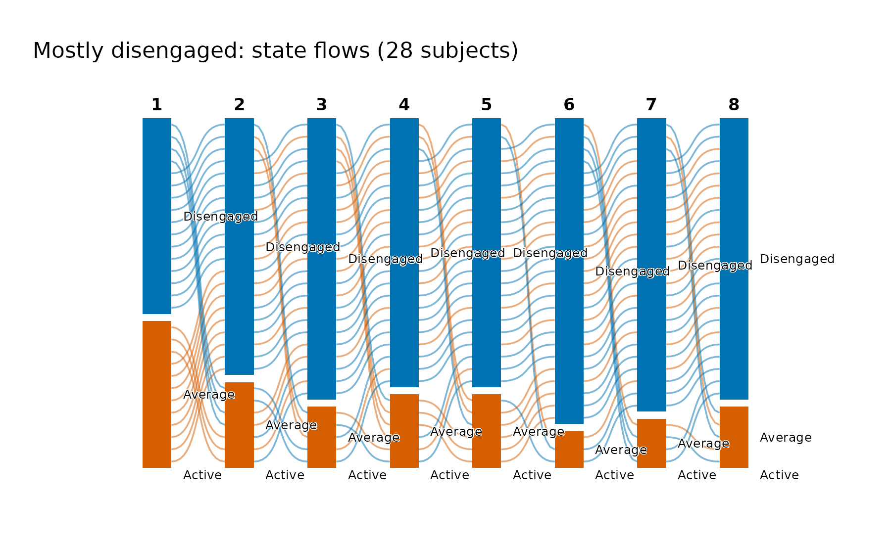

## 6. The transition network: movement collapsed over time

Every view so far keeps time on the horizontal axis. Collapsing all
seven steps into one network drops the timing and asks a different
question: across the whole course, which states attract movement and
which emit it?
[`transition_plot()`](https://sonsoles.me/vasstra/reference/transition_plot.md)
builds that network with
[`Nestimate::build_tna()`](https://saqr.me/Nestimate/reference/build_tna.html),
takes its centralities from
[`Nestimate::net_centrality()`](https://saqr.me/Nestimate/reference/net_centrality.html),
and hands the result to
[`cograph::splot()`](https://sonsoles.me/cograph/reference/splot.html),
which recognises the network and supplies the TNA styling, the labels,
and the rings showing each state’s initial probability. Node size is
in-strength — the total incoming transition weight — so the biggest node
is the state the cohort most often moves into.

``` r

transition_plot(fit)
```

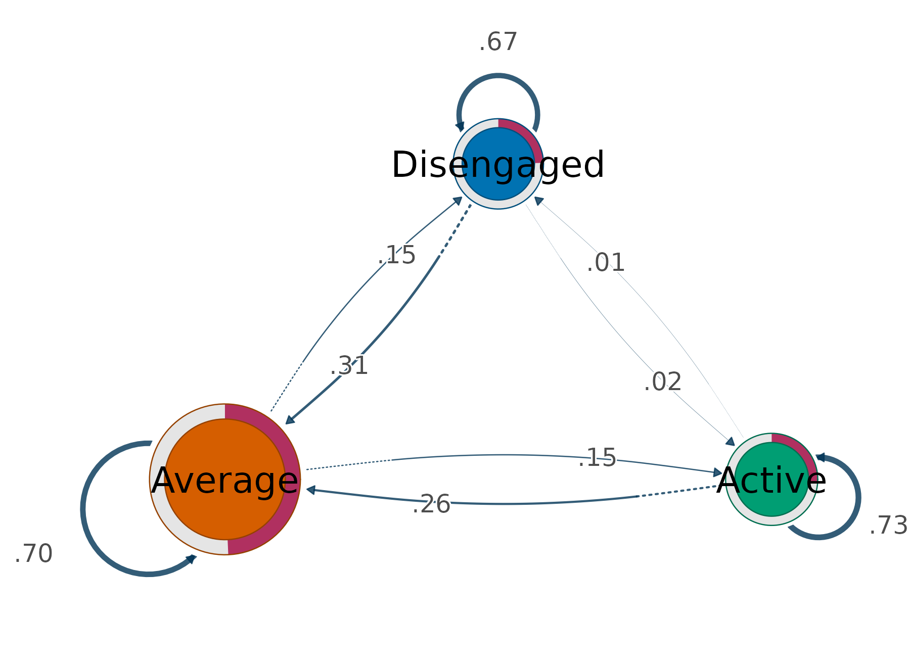

The same centralities are available as a table without drawing anything,
which is what makes the size comparison checkable rather than
impressionistic.

``` r

transition_centrality(fit)
#>        state InStrength OutStrength
#> 1     Active  0.1713675   0.2678571
#> 2    Average  0.5726801   0.3020833
#> 3 Disengaged  0.1592262   0.3333333
```

Average’s in-strength of 0.57 is more than three times either extreme,
and that single number is the quantitative form of the waypoint result
from section 1: movement does not merely pass through Average, it
accumulates there. The two extremes are almost indistinguishable on this
measure (0.159 against 0.171) even though their self-transition
probabilities differ noticeably (0.67 for Disengaged against 0.73 for
Active), because in-strength excludes self-loops by default. Persistence
and attraction are genuinely different properties, and keeping them
apart is the reason for that default.

Setting `loops = TRUE` folds persistence back in, and the ordering
changes character entirely — the nodes become nearly equal in size
because every state mostly retains its own members.

``` r

transition_plot(fit, loops = TRUE)
```

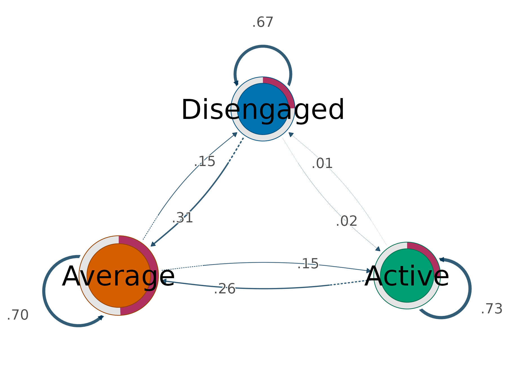

`weights = "count"` swaps transition probabilities for raw counts, which
is the version to report when the absolute volume of movement matters
rather than its conditional likelihood, and `size` accepts any measure
[`Nestimate::net_centrality()`](https://saqr.me/Nestimate/reference/net_centrality.html)
offers — `measures = "all"` on
[`transition_centrality()`](https://sonsoles.me/vasstra/reference/transition_centrality.md)
lists them.

``` r

transition_plot(fit, weights = "count", size = "OutStrength")
```

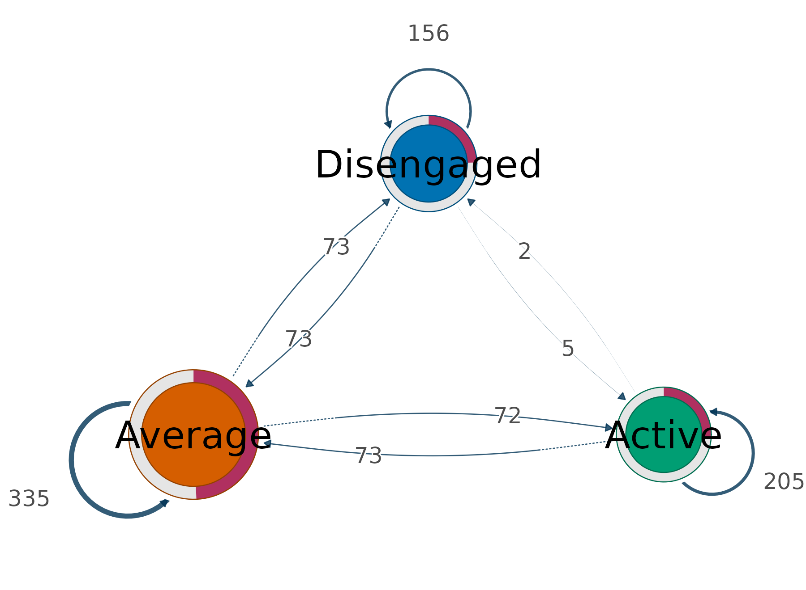

Restricted to one trajectory, the network becomes a compact summary of
how that group moves — and a group that never reaches a state simply has
no node for it.

``` r

transition_plot(fit, group = "Mostly disengaged")
```

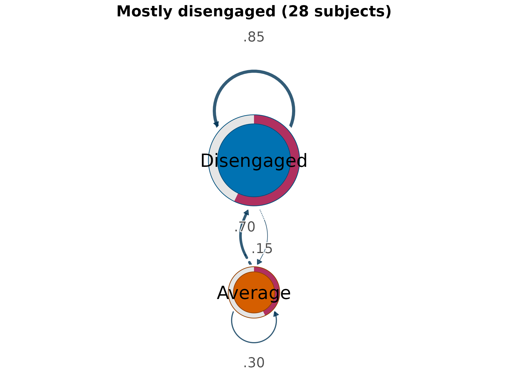

### Sequences and network side by side

The network summarises movement but hides the data it came from, so the
conventional presentation puts the two together: the raw sequences on
the left, their transition network on the right. `sequences = TRUE`
draws both on one device, and because the panels share a palette a state
has the same colour in each.

``` r

transition_plot(fit, sequences = TRUE, group = "Mostly active")
```

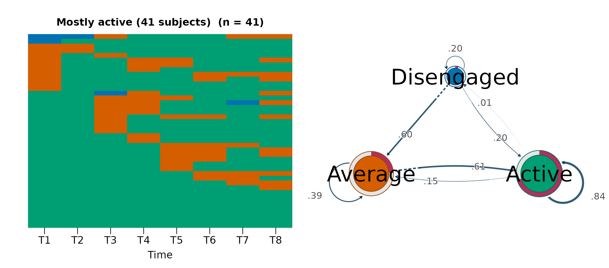

The pairing is what makes each panel legible. The left panel shows a
green field with orange interruptions, and the right explains its shape:
Active retains 0.84 of its members from one position to the next, and
the only substantial route out of it leads to Average rather than to
Disengaged, whose node is barely present. Reading either panel alone
would leave the other half of that statement unsupported.

`sequences` also accepts `"heatmap"` or `"distribution"` for the left
panel, and the argument changes only the layout — the centralities are
identical either way.

``` r

transition_plot(fit, sequences = "heatmap", group = "Mostly disengaged")
```

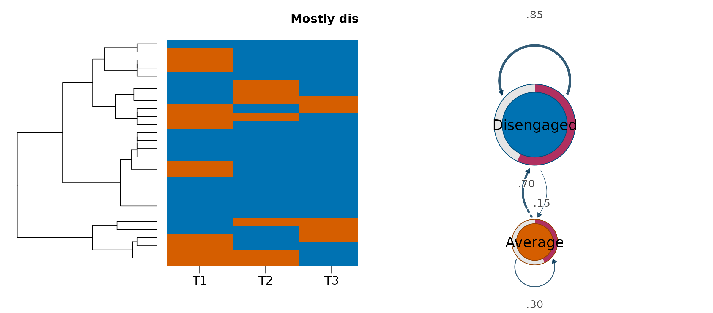

## Where flow plots fit

The package keeps two rendering paths, and each owns a distinct
question. Nestimate renders the sequence views — heatmap, index, and
distribution — which are all organised by *subject similarity or
composition*, and it also builds the transition network and its
centralities. cograph draws the movement views: the flow diagrams,
organised by *movement between consecutive times*, and the transition
network, which discards timing altogether.

The three answers compose. The distribution establishes that the
composition is stable; the alluvial establishes that the stability is an
equilibrium rather than an absence of change; and the transition network
puts a number on where that exchange concentrates. None of the three is
a substitute for the others, and the first on its own is the one most
easily misread.

Method overview: [VaSSTra
chapter](https://lamethods.org/book1/chapters/ch11-vasstra/ch11-vasstra.html).
