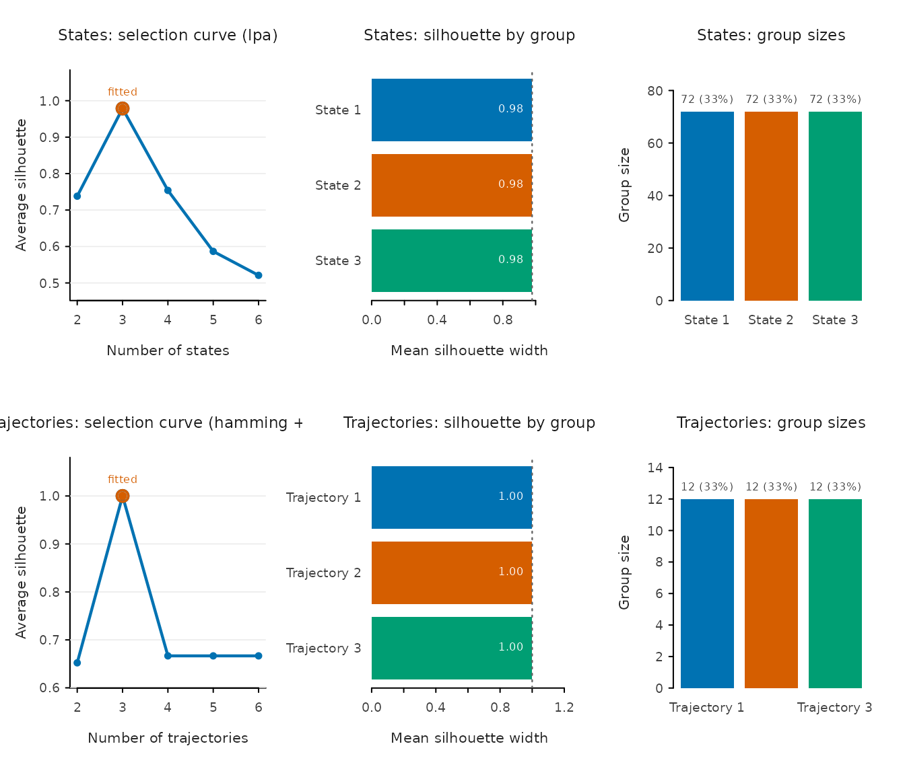
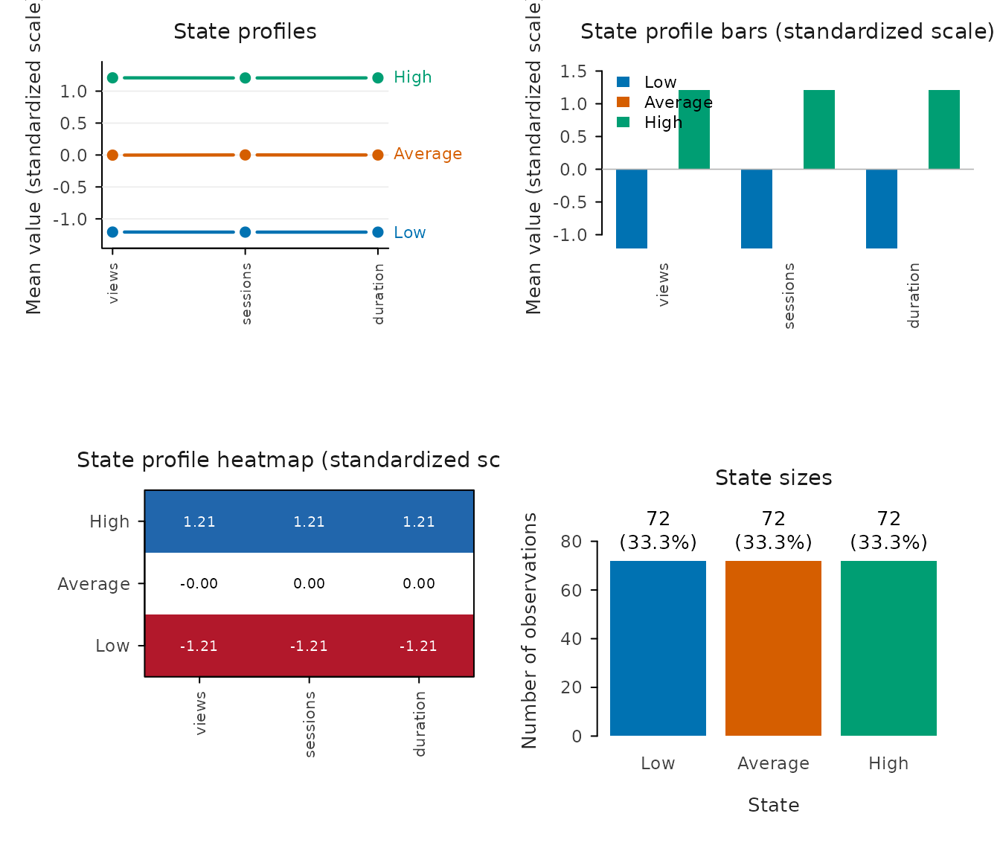
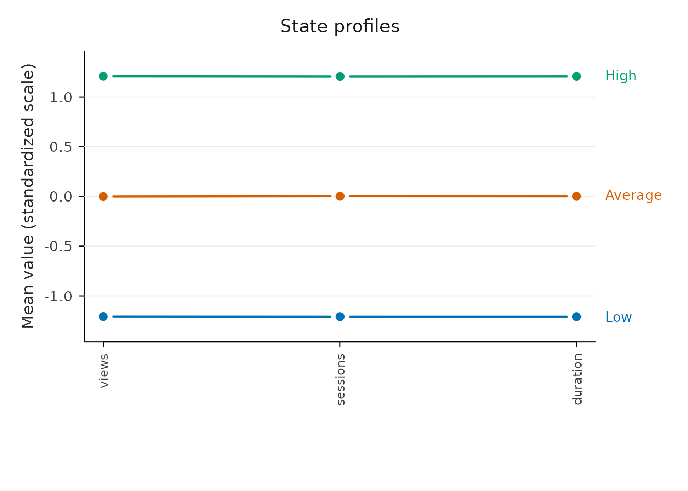
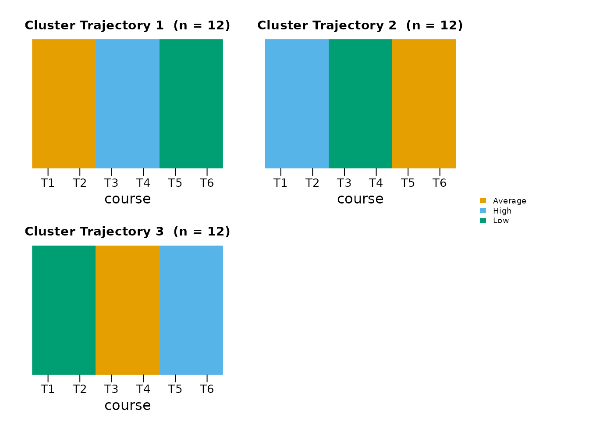
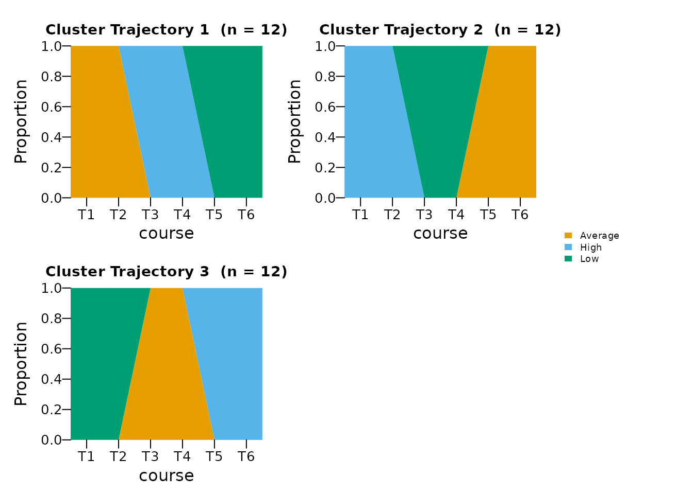
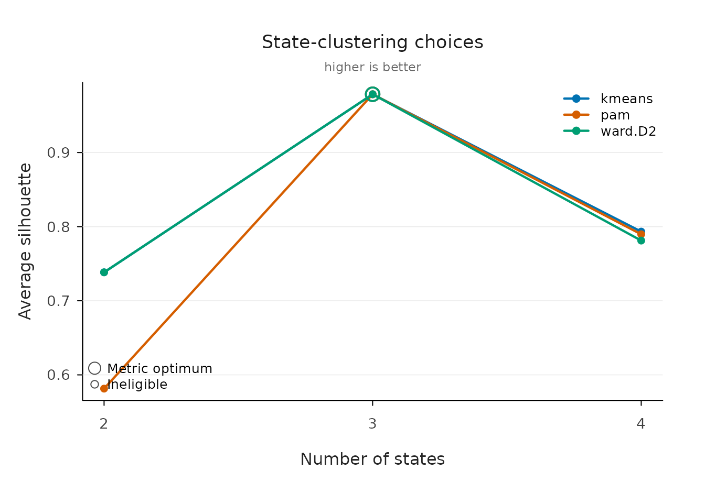
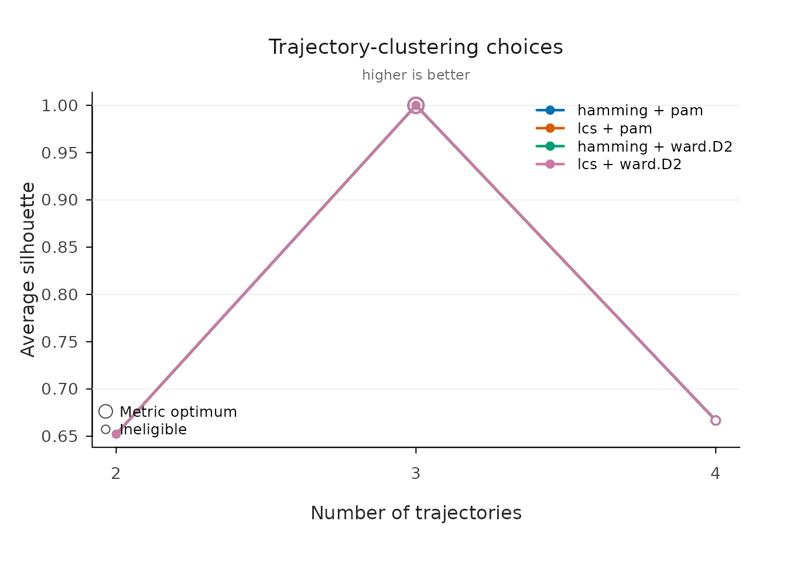

# VaSStra in Four Simple Steps

VaSStra turns repeated multivariate measurements into states, state
sequences, and groups of similar trajectories. The whole analysis is one
call, and every part of it can also be run as an explicit step.

``` r

library(VaSStra)

set.seed(2026)
data <- expand.grid(
  student = seq_len(36),
  course = seq_len(6)
)
trajectory <- ceiling(data$student / 12)
# Three groups of twelve students climb the same three-phase ladder,
# each starting one phase further along, so the groups differ in timing
# rather than in level.
phase <- ceiling(data$course / 2)
latent_state <- (phase + trajectory - 2) %% 3 + 1
data$views <- latent_state * 6 + rnorm(nrow(data), sd = 0.08)
data$sessions <- latent_state * 3 + rnorm(nrow(data), sd = 0.08)
data$duration <- latent_state * 12 + rnorm(nrow(data), sd = 0.08)
```

## One call

[`vasstra()`](https://pak.dynasite.org/VaSStra/reference/vasstra.md)
detects the subject, time, and indicator roles from common column names
(or attached role metadata), compares two through six states and
trajectories, and fits the recommended counts. Every automated decision
is reported as it is made and recorded inside the fit.

``` r

fit <- vasstra(data)
#> Detected id = "student", time = "course", variables = 3 numeric indicators.
#> Selected n_states = 3 (lpa, bic = -3020.208); see `diagnostics$selection`.
#> Selected n_trajectories = 3 (hamming + pam, silhouette = 1.000); see `diagnostics$selection`.
fit
#> VaSStra Analysis
#>   36 subjects | 6 times | 3 states | 3 trajectories
#>   hamming + pam | silhouette 1.000
```

Tidy tables come straight from the fit at the analysis unit you need:

``` r

head(as.data.frame(fit))
#>   student   trajectory n_observed unique_states transitions entropy complexity
#> 1       1 Trajectory 1          6             3           2       1  0.6324555
#> 2       2 Trajectory 1          6             3           2       1  0.6324555
#> 3       3 Trajectory 1          6             3           2       1  0.6324555
#> 4       4 Trajectory 1          6             3           2       1  0.6324555
#> 5       5 Trajectory 1          6             3           2       1  0.6324555
#> 6       6 Trajectory 1          6             3           2       1  0.6324555
#>   volatility integrative_potential negative_exposure
#> 1        0.7                    NA                NA
#> 2        0.7                    NA                NA
#> 3        0.7                    NA                NA
#> 4        0.7                    NA                NA
#> 5        0.7                    NA                NA
#> 6        0.7                    NA                NA
head(as.data.frame(fit, unit = "observation"))
#>   student course   state position   trajectory
#> 1       1      1 State 1        1 Trajectory 1
#> 2       1      2 State 1        2 Trajectory 1
#> 3       1      3 State 2        3 Trajectory 1
#> 4       1      4 State 2        4 Trajectory 1
#> 5       1      5 State 3        5 Trajectory 1
#> 6       1      6 State 3        6 Trajectory 1
as.data.frame(fit, unit = "trajectory")
#>     trajectory  n proportion mean_within_distance n_observed unique_states
#> 1 Trajectory 1 12  0.3333333                    0          6             3
#> 2 Trajectory 2 12  0.3333333                    0          6             3
#> 3 Trajectory 3 12  0.3333333                    0          6             3
#>   transitions entropy complexity volatility integrative_potential
#> 1           2       1  0.6324555        0.7                   NaN
#> 2           2       1  0.6324555        0.7                   NaN
#> 3           2       1  0.6324555        0.7                   NaN
#>   negative_exposure
#> 1               NaN
#> 2               NaN
#> 3               NaN
```

Name any decision to take it over; automation only fills what you omit.
Labels are the shortest way to fix a count — three labels mean three
states — and a candidate vector such as `n_states = 2:4` compares
exactly those counts and fits the recommended one.

``` r

fit <- vasstra(
  data,
  state_labels = c("Low", "Average", "High"),
  trajectory_labels = c("Stable low", "Moving", "Stable high"),
  dissimilarity = "lcs",
  cluster_method = "ward.D2",
  positive_states = "High",
  negative_states = "Low"
)
```

## Evaluate the clustering

[`evaluate()`](https://pak.dynasite.org/VaSStra/reference/evaluate.md)
compares the fitted numbers of states and trajectories against the
neighboring counts and reports per-cluster quality. Printing shows both
tables; plotting draws the selection curve, per-cluster silhouette
widths, and group sizes.

``` r

evaluation <- evaluate(fit)
evaluation
#> VaSStra clustering evaluation: states (lpa)
#>   Fitted: 3 states | silhouette 0.979
#>   Candidates:
#>  n_states method lpa_model silhouette       bic       aic
#>         2    lpa       EEI      0.738  1252.237  1218.485
#>         3    lpa       EEI      0.979 -3020.208 -3067.462
#>         4    lpa       EEI      0.754 -3008.104 -3068.859
#>         5    lpa       EEI      0.587 -2988.741 -3062.997
#>         6    lpa       EEI      0.521 -2968.898 -3056.655
#>  classification_entropy min_size max_size size_ratio eligible  best fitted
#>                   0.997       72      144          2     TRUE FALSE  FALSE
#>                   1.000       72       72          1     TRUE  TRUE   TRUE
#>                   0.967        4       72         18    FALSE FALSE  FALSE
#>                   0.935        3       72         24    FALSE FALSE  FALSE
#>                   0.924        1       72         72    FALSE FALSE  FALSE
#>   Fitted states:
#>    state  n proportion silhouette
#>  State 1 72      0.333      0.978
#>  State 2 72      0.333      0.979
#>  State 3 72      0.333      0.979
#> 
#> VaSStra clustering evaluation: trajectories (hamming + pam)
#>   Fitted: 3 trajectories | silhouette 1.000
#>   Candidates:
#>  n_trajectories dissimilarity method silhouette mean_within_distance min_size
#>               2       hamming    pam      0.652                2.087       12
#>               3       hamming    pam      1.000                0.000       12
#>               4       hamming    pam      0.667                0.000        1
#>               5       hamming    pam      0.667                0.000        1
#>               6       hamming    pam      0.667                0.000        1
#>  max_size size_ratio eligible  best fitted
#>        24          2     TRUE FALSE  FALSE
#>        12          1     TRUE  TRUE   TRUE
#>        12         12    FALSE FALSE  FALSE
#>        12         12    FALSE FALSE  FALSE
#>        12         12    FALSE FALSE  FALSE
#>   Fitted trajectories:
#>    trajectory  n proportion mean_within_distance silhouette
#>  Trajectory 1 12      0.333                    0          1
#>  Trajectory 2 12      0.333                    0          1
#>  Trajectory 3 12      0.333                    0          1
```

``` r

plot(evaluation)
```



The same verb works on a single step, with any candidate range:

``` r

state_evaluation <- evaluate(fit$states, n_states = 2:5)
as.data.frame(state_evaluation)
#>   n_states method lpa_model silhouette       bic       aic
#> 1        2    lpa       EEI  0.7380052  1252.237  1218.485
#> 2        3    lpa       EEI  0.9786523 -3020.208 -3067.462
#> 3        4    lpa       EEI  0.7539322 -3008.104 -3068.859
#> 4        5    lpa       EEI  0.5866211 -2988.741 -3062.997
#>   classification_entropy min_size max_size size_ratio eligible  best fitted
#> 1              0.9974592       72      144          2     TRUE FALSE  FALSE
#> 2              1.0000000       72       72          1     TRUE  TRUE   TRUE
#> 3              0.9670127        4       72         18    FALSE FALSE  FALSE
#> 4              0.9354653        3       72         24    FALSE FALSE  FALSE
summary(state_evaluation)
#>     state  n proportion silhouette
#> 1 State 1 72  0.3333333  0.9780484
#> 2 State 2 72  0.3333333  0.9789273
#> 3 State 3 72  0.3333333  0.9789813
```

## Tidy fit indices

[`fit_indices()`](https://pak.dynasite.org/VaSStra/reference/fit_indices.md)
reports the fit statistics of the selected clustering as one tidy row,
or one row per compared candidate with `compare = TRUE`. LPA models
report the complete information-criterion family together with entropy
and the extreme average posterior class probabilities; hard-clustering
methods report their own objectives instead, and columns that do not
apply are dropped.

``` r

fit_indices(fit)
#> VaSStra fit indices: states (lpa)
#>  n_states method lpa_model log_likelihood n_parameters      aic      bic
#>         3    lpa       EEI        1547.73           14 -3067.46 -3020.21
#>     sabic     caic      awe      clc      kic      icl entropy prob_min
#>  -3064.57 -3006.21 -2902.95 -3095.46 -3050.46 -3020.21       1        1
#>  prob_max silhouette min_size max_size size_ratio
#>         1      0.979       72       72          1
fit_indices(fit, compare = TRUE)
#> VaSStra fit indices: states (lpa)
#>  n_states method lpa_model log_likelihood n_parameters      aic      bic
#>         2    lpa       EEI        -599.24           10  1218.48  1252.24
#>         3    lpa       EEI        1547.73           14 -3067.46 -3020.21
#>         4    lpa       EEI        1552.43           18 -3068.86 -3008.10
#>         5    lpa       EEI        1553.50           22 -3063.00 -2988.74
#>         6    lpa       EEI        1554.33           26 -3056.66 -2968.90
#>     sabic     caic      awe      clc      kic      icl entropy prob_min
#>   1220.55  1262.24  1335.99  1199.25  1231.48  1253.00   0.997    1.000
#>  -3064.57 -3006.21 -2902.95 -3095.46 -3050.46 -3020.21   1.000    1.000
#>  -3065.14 -2990.10 -2857.35 -3085.10 -3047.86 -2988.35   0.967    0.829
#>  -3058.45 -2966.74 -2804.48 -3062.13 -3038.00 -2943.87   0.935    0.730
#>  -3051.29 -2942.90 -2751.14 -3049.93 -3027.66 -2910.17   0.924    0.770
#>  prob_max silhouette min_size max_size size_ratio eligible  best fitted
#>         1      0.738       72      144          2     TRUE FALSE  FALSE
#>         1      0.979       72       72          1     TRUE  TRUE   TRUE
#>         1      0.754        4       72         18    FALSE FALSE  FALSE
#>         1      0.587        3       72         24    FALSE FALSE  FALSE
#>         1      0.521        1       72         72    FALSE FALSE  FALSE
fit_indices(fit, step = "trajectories", compare = TRUE)
#> VaSStra fit indices: trajectories (hamming + pam)
#>  n_trajectories dissimilarity method silhouette mean_within_distance min_size
#>               2       hamming    pam      0.652                 2.09       12
#>               3       hamming    pam      1.000                 0.00       12
#>               4       hamming    pam      0.667                 0.00        1
#>               5       hamming    pam      0.667                 0.00        1
#>               6       hamming    pam      0.667                 0.00        1
#>  max_size size_ratio eligible  best fitted
#>        24          2     TRUE FALSE  FALSE
#>        12          1     TRUE  TRUE   TRUE
#>        12         12    FALSE FALSE  FALSE
#>        12         12    FALSE FALSE  FALSE
#>        12         12    FALSE FALSE  FALSE
```

## Name groups after inspecting them

[`set_labels()`](https://pak.dynasite.org/VaSStra/reference/set_labels.md)
renames fitted states or trajectories in place — nothing is refitted, no
value changes — and the new names flow through every table, sequence,
and plot. Rename everything with a full vector, or only some groups by
name.

``` r

fit <- set_labels(
  fit,
  states = c("Low", "Average", "High"),
  trajectories = c("Mostly high", "Mixed", "Mostly low")
)
summary(fit)
#>    trajectory  n proportion mean_within_distance n_observed unique_states
#> 1 Mostly high 12  0.3333333                    0          6             3
#> 2       Mixed 12  0.3333333                    0          6             3
#> 3  Mostly low 12  0.3333333                    0          6             3
#>   transitions entropy complexity volatility integrative_potential
#> 1           2       1  0.6324555        0.7                   NaN
#> 2           2       1  0.6324555        0.7                   NaN
#> 3           2       1  0.6324555        0.7                   NaN
#>   negative_exposure
#> 1               NaN
#> 2               NaN
#> 3               NaN
```

## The same analysis in four explicit steps

Each step accepts the result of the previous step and also runs alone
with the same automated defaults. Use the steps when intermediate
results are needed, or when states come from another method.

``` r

states <- step1_states(data, n_states = 3,
                       labels = c("Low", "Average", "High"))
#> Detected id = "student", time = "course", variables = 3 numeric indicators.
sequences <- step2_sequences(states)
trajectories <- step3_trajectories(sequences, n_trajectories = 3)
description <- step4_describe(
  trajectories,
  positive_states = "High",
  negative_states = "Low"
)
summary(description)
#>     trajectory  n proportion mean_within_distance n_observed unique_states
#> 1 Trajectory 1 12  0.3333333                    0          6             3
#> 2 Trajectory 2 12  0.3333333                    0          6             3
#> 3 Trajectory 3 12  0.3333333                    0          6             3
#>   transitions entropy complexity volatility integrative_potential
#> 1           2       1  0.6324555        0.7             0.3333333
#> 2           2       1  0.6324555        0.7             0.1428571
#> 3           2       1  0.6324555        0.7             0.5238095
#>   negative_exposure
#> 1         0.5238095
#> 2         0.3333333
#> 3         0.1428571
```

Existing states from LPA, LCA, or any other source enter at step 2: pass
a data frame whose state column is detected (or named with `state`).

## State plots

State results support profile, bar, heatmap, and size plots without
adding a plotting dependency, plus a combined overview.

``` r

plot(states, type = "all")
```



``` r

plot(states, type = "profile")
```



## Sequence and trajectory plots

Every plot containing state sequences is rendered by Nestimate:

``` r

plot(trajectories, type = "index")
```



``` r

plot(trajectories, type = "distribution")
```



## Compare candidates in full detail

When automation should be replaced by an explicit comparison,
[`state_choices()`](https://pak.dynasite.org/VaSStra/reference/state_choices.md)
and
[`trajectory_choices()`](https://pak.dynasite.org/VaSStra/reference/trajectory_choices.md)
fit a grid across methods and counts and return one tidy row per
candidate. Nothing is selected silently; pass the inspected
`candidate_id` to fit.

``` r

state_options <- state_choices(
  data,
  n_states = 2:4,
  method = c("kmeans", "pam", "ward.D2")
)
#> Detected id = "student", time = "course", variables = 3 numeric indicators.
state_options
#> VaSStra state choices
#>   9 candidates | 9 successful | 3 recommended
#>  candidate_id n_states  method lpa_model recommendation_criterion silhouette
#>             2        3  kmeans      <NA>               silhouette  0.9786523
#>             5        3     pam      <NA>               silhouette  0.9786523
#>             8        3 ward.D2      <NA>               silhouette  0.9786523
#>  bic min_size eligible
#>   NA       72     TRUE
#>   NA       72     TRUE
#>   NA       72     TRUE
plot(state_options, metric = "silhouette")
```



``` r

chosen_states <- fit_state_choice(
  state_options,
  n_states = 3,
  method = "kmeans",
  labels = c("Low", "Average", "High")
)
```

`fit_state_choice(state_options)` with no selection fits the recommended
candidate; `candidate_id` remains available for exact row selection.

Average silhouette is the common diagnostic across all methods; larger
values indicate better-separated groups. Recommendations identify the
best eligible candidate separately for each method rather than declaring
one algorithm universally best. LPA candidates are recommended by
conventional BIC, with AIC, silhouette, or native mclust ICL available
through `lpa_criterion`.

``` r

trajectory_options <- trajectory_choices(
  step2_sequences(chosen_states),
  n_trajectories = 2:4,
  dissimilarity = c("hamming", "lcs"),
  method = c("pam", "ward.D2")
)
trajectory_options
#> VaSStra trajectory choices (Nestimate)
#>   12 candidates | 4 recommended distance-method solutions
#>  candidate_id n_trajectories dissimilarity  method silhouette min_size eligible
#>             2              3       hamming     pam          1       12     TRUE
#>             5              3           lcs     pam          1       12     TRUE
#>             8              3       hamming ward.D2          1       12     TRUE
#>            11              3           lcs ward.D2          1       12     TRUE
plot(trajectory_options, metric = "silhouette")
```



Recommendations are made within each distance-method pair because mean
within-trajectory distances are only comparable within one
dissimilarity.

States default to mclust latent profiles (`"EEI"`, tidyLPA model 1);
base R supplies k-means and hierarchical clustering, `cluster` supplies
PAM, and Nestimate supplies sequence distances, trajectory clustering,
and plots. No TraMineR plotting path or dependency is required.
