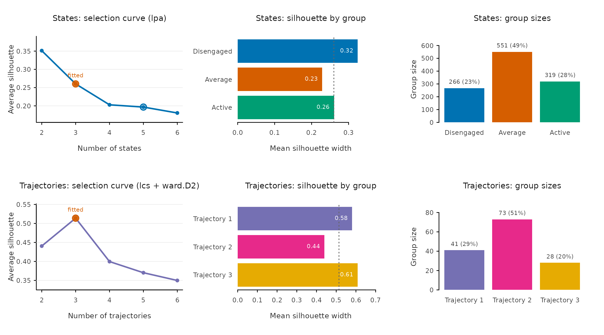
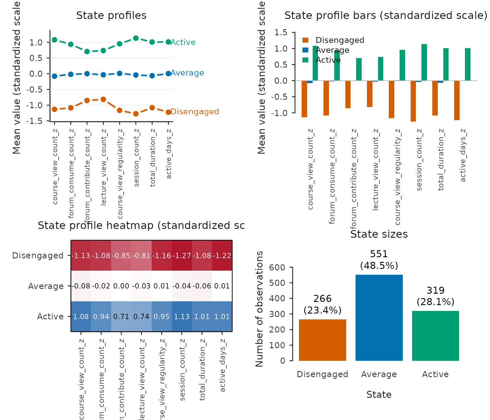
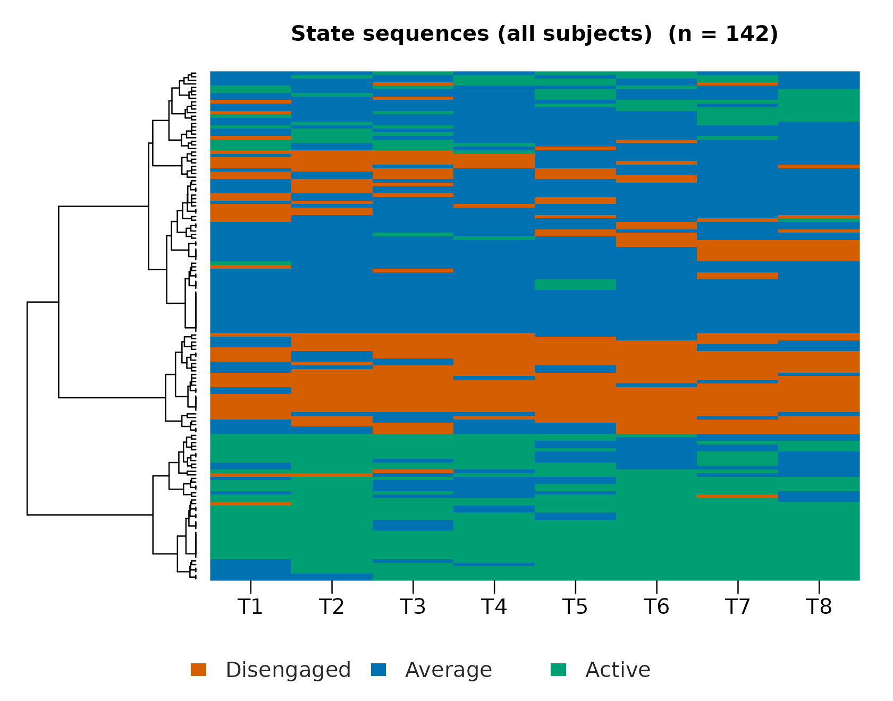
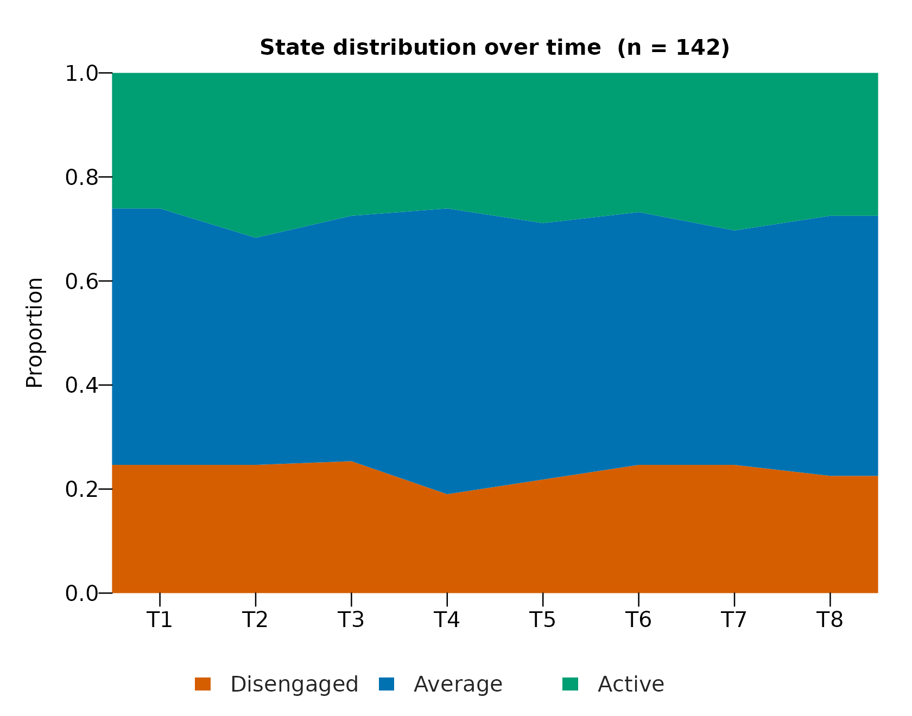
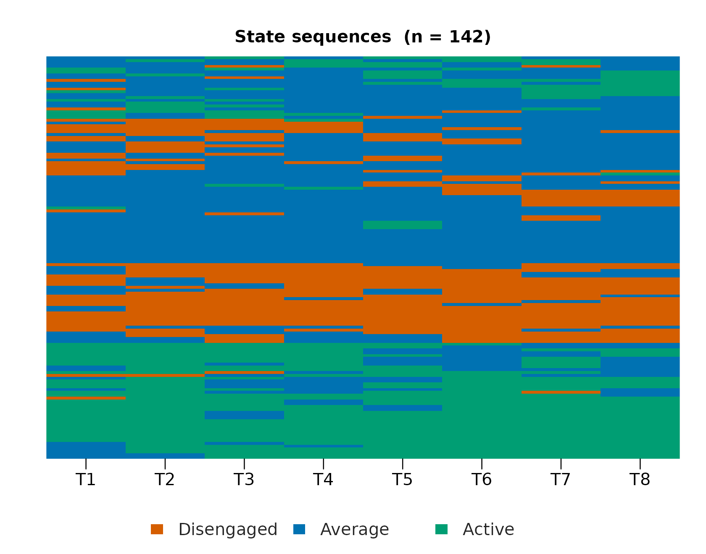
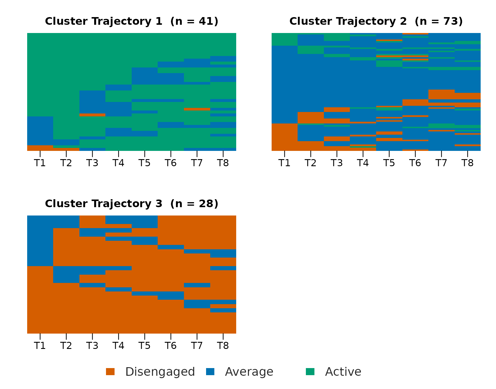
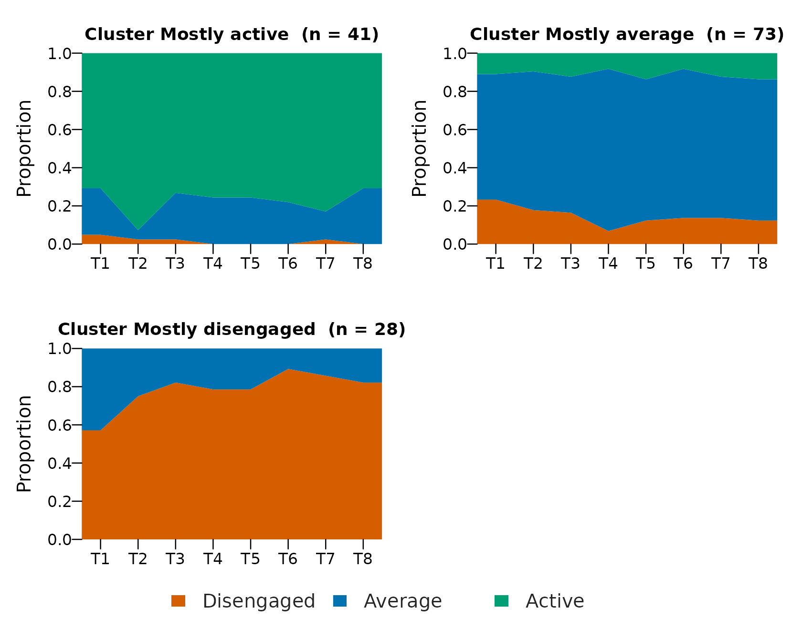
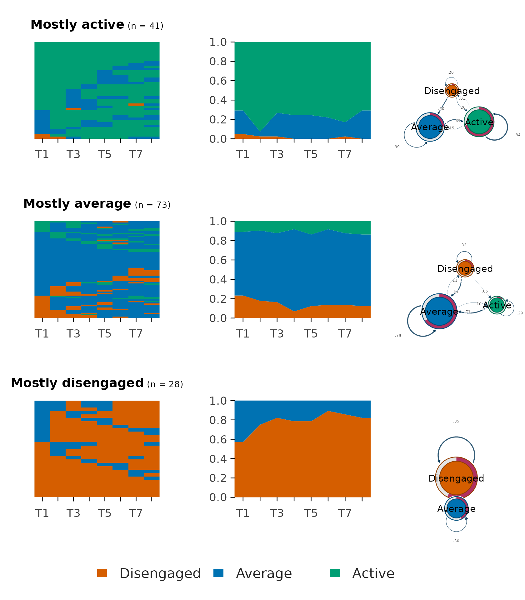
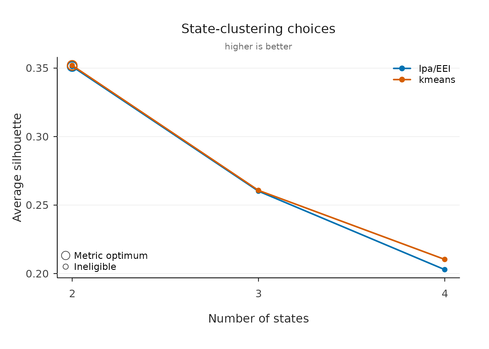

# VaSSTra Tutorial: Variables, States, Sequences, Trajectories

Longitudinal engagement data have a structural problem: eight indicators
per student per course are too many dimensions to compare students on,
and averaging them across time destroys exactly the thing that matters —
how each student changes. The VaSSTra method solves this in three
compressions. Multivariate observations become a small set of
interpretable **states**; each student’s states, ordered in time, become
a **sequence**; and students whose sequences resemble each other become
**trajectories** — a person-centered summary of change that a single
regression coefficient cannot express.

This tutorial runs the complete workflow on the longitudinal engagement
data from the [VaSSTra
chapter](https://lamethods.org/book1/chapters/ch11-vasstra/ch11-vasstra.html)
of *Learning Analytics Methods and Tutorials*, in this order:

1.  The complete analysis in one call.
2.  Choosing and defending the number of states.
3.  Understanding what the states are.
4.  Sequences: how states unfold over time.
5.  Trajectories: groups of similar journeys.
6.  Describing what the trajectories mean.
7.  Relabeling without refitting.
8.  Full control: explicit steps and grid comparisons.

| Task | Verb |
|----|----|
| Complete analysis | [`vasstra()`](https://sonsoles.me/vasstra/reference/vasstra.md) |
| Compare cluster counts | [`evaluate()`](https://sonsoles.me/vasstra/reference/evaluate.md), [`plot()`](https://rdrr.io/r/graphics/plot.default.html) |
| Fit statistics | [`fit_indices()`](https://sonsoles.me/vasstra/reference/fit_indices.md) |
| Rename groups | [`set_labels()`](https://sonsoles.me/vasstra/reference/set_labels.md) |
| Tidy results | [`as.data.frame()`](https://rdrr.io/r/base/as.data.frame.html), [`summary()`](https://rdrr.io/r/base/summary.html) |
| Individual steps | [`step1_states()`](https://sonsoles.me/vasstra/reference/step1_states.md) … [`step4_describe()`](https://sonsoles.me/vasstra/reference/step4_describe.md) |
| Explicit grids | [`state_choices()`](https://sonsoles.me/vasstra/reference/state_choices.md), [`trajectory_choices()`](https://sonsoles.me/vasstra/reference/trajectory_choices.md) |

## 1. The complete analysis in one call

The `engagement` data ship analysis-ready: 142 students at eight course
positions, with eight course-standardized indicators and attached role
metadata, so no column plumbing is needed. The chapter’s substantive
decision — three latent profiles named Disengaged, Average, and Active —
is expressed entirely by the labels: three labels mean three states,
estimated by latent profile analysis (mclust `"EEI"`, the chapter’s
tidyLPA Model 1) because that is the default state method. The LCS
distance with Ward clustering follows the chapter’s trajectory analysis.

``` r

library(VaSSTra)
data("engagement", package = "VaSSTra")

fit <- vasstra(
  engagement,
  state_labels = c("Disengaged", "Average", "Active"),
  state_order  = c("Disengaged", "Average", "Active"),
  state_colors = c(Disengaged = "#D55E00", Average = "#0072B2", Active = "#009E73"),
  dissimilarity = "lcs",
  cluster_method = "ward.D2",
  positive_states = "Active",
  negative_states = "Disengaged"
)
#> Using n_states = 3 to match the supplied labels.
#> Registered S3 method overwritten by 'Nestimate':
#>   method     from   
#>   print.mcml cograph
#> Selected n_trajectories = 3 (lcs + ward.D2, silhouette = 0.514); see `diagnostics$selection`.
fit
#> VaSSTra Analysis
#>   142 subjects | 8 times | 3 states | 3 trajectories
#>   lcs + ward.D2 | silhouette 0.514
```

`state_order` fixes the order the states read in every plot and
`state_colors` pins their palette, so the whole analysis below is drawn
consistently; both are optional and default to the discovery order and
the package palette.

The one remaining automated decision — the number of trajectories — is
reported in the message and stored with its full comparison table in the
fit, so it can be defended later rather than taken on faith. Leaving the
labels out too (`vasstra(engagement)`) automates the state count as
well; automation never selects a solution whose smallest group holds
under five percent of observations, the conventional threshold below
which latent classes are treated as spurious.

## 2. Choosing and defending the number of states

A fitted clustering is a claim, and the claim needs two kinds of
evidence: that the chosen count beats its neighbors, and that the chosen
solution is internally sound.
[`evaluate()`](https://sonsoles.me/vasstra/reference/evaluate.md)
provides both in one object — a candidate table across counts and a
per-group quality table for the fitted solution.

``` r

evaluation <- evaluate(fit)
evaluation
#> VaSSTra clustering evaluation: states (lpa)
#>   Fitted: 3 states | silhouette 0.260
#>   Candidates:
#>  n_states method lpa_model silhouette      bic      aic classification_entropy
#>         2    lpa       EEI      0.351 21679.00 21553.12                  0.903
#>         3    lpa       EEI      0.260 20120.13 19948.93                  0.894
#>         4    lpa       EEI      0.203 19362.24 19145.73                  0.893
#>         5    lpa       EEI      0.197 19008.96 18747.13                  0.871
#>         6    lpa       EEI      0.181 18600.79 18293.64                  0.887
#>  min_size max_size size_ratio eligible  best fitted
#>       509      627      1.232     TRUE FALSE  FALSE
#>       266      551      2.071     TRUE FALSE   TRUE
#>       152      414      2.724     TRUE FALSE  FALSE
#>       155      367      2.368     TRUE  TRUE  FALSE
#>        33      350     10.606    FALSE FALSE  FALSE
#>   Fitted states:
#>       state   n proportion silhouette
#>  Disengaged 266      0.234      0.325
#>     Average 551      0.485      0.229
#>      Active 319      0.281      0.261
#> 
#> VaSSTra clustering evaluation: trajectories (lcs + ward.D2)
#>   Fitted: 3 trajectories | silhouette 0.514
#>   Candidates:
#>  n_trajectories dissimilarity  method silhouette mean_within_distance min_size
#>               2           lcs ward.D2      0.440                6.353       41
#>               3           lcs ward.D2      0.514                4.541       28
#>               4           lcs ward.D2      0.400                4.172       28
#>               5           lcs ward.D2      0.370                3.918        8
#>               6           lcs ward.D2      0.350                3.595        8
#>  max_size size_ratio eligible  best fitted
#>       101      2.463     TRUE FALSE  FALSE
#>        73      2.607     TRUE  TRUE   TRUE
#>        43      1.536     TRUE FALSE  FALSE
#>        43      5.375     TRUE FALSE  FALSE
#>        43      5.375     TRUE FALSE  FALSE
#>   Fitted trajectories:
#>    trajectory  n proportion mean_within_distance silhouette
#>  Trajectory 1 41      0.289                4.259      0.581
#>  Trajectory 2 73      0.514                4.961      0.440
#>  Trajectory 3 28      0.197                3.857      0.609
```

``` r

plot(evaluation)
```



The two rows of panels answer different questions. The trajectory
selection curve peaks at the fitted three groups (silhouette 0.51
against 0.44 and 0.40 for two and four), so the automated choice is also
the local optimum — the strongest position a selection can be in. The
state curve instead *declines* from two: with LPA the count was fixed by
the three labels, and the panel makes the cost of that substantive
choice visible (0.26 at three against 0.35 at two) instead of hiding it.
The silhouette-by-group bars then locate where cohesion comes from: the
two flanking groups are the most compact (0.58 and 0.61), while the
large middle trajectory (0.44) is the first place to look when judging
whether three groups over-merge distinct journeys.

For the model-based evidence reviewers expect,
[`fit_indices()`](https://sonsoles.me/vasstra/reference/fit_indices.md)
returns the complete information-criterion family as one tidy row — the
same content as tidyLPA’s fit table, plus the classification-quality
columns that usually have to be assembled by hand.

``` r

fit_indices(fit)
#> VaSSTra fit indices: states (lpa)
#>  n_states method lpa_model log_likelihood n_parameters      aic      bic
#>         3    lpa       EEI       -9940.47           34 19948.93 20120.13
#>     sabic     caic      awe      clc      kic      icl entropy prob_min
#>  20012.14 20154.13 20461.33 20144.89 19985.93 20384.09   0.894    0.945
#>  prob_max silhouette min_size max_size size_ratio
#>     0.956       0.26      266      551       2.07
```

Three of these numbers carry the interpretation. Entropy (0.89) says the
posterior classification is sharp overall; `prob_min` (0.94) says even
the *worst* class assigns its members with high confidence — entropy
summarizes the whole matrix, `prob_min` guards its weakest class, and
reporting both prevents a good average from hiding a bad class. The
criterion family (AIC through ICL) is there for the comparison table:

``` r

fit_indices(fit, compare = TRUE)
#> VaSSTra fit indices: states (lpa)
#>  n_states method lpa_model log_likelihood n_parameters      aic      bic
#>         2    lpa       EEI      -10751.56           25 21553.12 21679.00
#>         3    lpa       EEI       -9940.47           34 19948.93 20120.13
#>         4    lpa       EEI       -9529.86           43 19145.73 19362.25
#>         5    lpa       EEI       -9321.57           52 18747.13 19008.96
#>         6    lpa       EEI       -9085.82           61 18293.64 18600.79
#>     sabic     caic      awe      clc      kic      icl entropy prob_min
#>  21599.59 21704.00 21929.88 21655.20 21581.12 21831.08   0.903    0.973
#>  20012.14 20154.13 20461.33 20144.89 19985.93 20384.09   0.894    0.945
#>  19225.66 19405.25 19793.76 19397.81 19191.73 19700.33   0.893    0.928
#>  18843.80 19060.96 19530.80 19113.95 18802.13 19479.79   0.871    0.873
#>  18407.04 18661.79 19212.95 18633.20 18357.64 19062.35   0.887    0.876
#>  prob_max silhouette min_size max_size size_ratio eligible  best fitted
#>     0.975      0.351      509      627       1.23     TRUE FALSE  FALSE
#>     0.956      0.260      266      551       2.07     TRUE FALSE   TRUE
#>     0.969      0.203      152      414       2.72     TRUE FALSE  FALSE
#>     0.964      0.197      155      367       2.37     TRUE  TRUE  FALSE
#>     0.973      0.181       33      350      10.61    FALSE FALSE  FALSE
```

Every criterion keeps falling through six classes — a nearly linear
decline with no elbow — which is precisely why the chapter’s three
profiles rest on interpretability and the classification-quality columns
rather than on a BIC minimum. The table makes that argument honest: the
`best` flag marks what pure criteria would pick, `fitted` marks what was
chosen, and the two need not agree.

## 3. Understanding what the states are

The states are only useful if they can be named, and naming requires
knowing how the profiles differ. The overview draws the four state views
together; each answers one question.

``` r

plot(fit, which = "states", type = "all")
```



The profile lines answer *what makes each state itself*: Active sits
around one standard deviation above course average on every indicator,
Disengaged about one below, Average on the line — engagement here is a
level, not a trade-off between, say, forum and lecture activity, which
is exactly what justifies ordered labels. The bars carry the same means
but grouped by indicator, which is the view for spotting whether any
single indicator breaks the ordering (none does). The heatmap adds the
exact magnitudes the lines only sketch — Disengaged is most extreme on
session count (−1.27) and least on lecture views (−0.81). The sizes
panel grounds prevalence: Average is the plurality (48%), and no state
is rare enough to question.

## 4. Sequences: how states unfold over time

The default sequence view is the heatmap: every aligned sequence as one
row, rows ordered by similarity, so persistence shows as long unbroken
bands and instability as speckle — the one view that keeps all 142
individual journeys visible at once.

``` r

plot(fit, which = "sequences")
```



Two further views split the temporal question the heatmap compresses.
The distribution answers the *aggregate* question — does the composition
of the cohort drift over the eight positions — while the index plot
answers the *individual* one on a fixed subject order. The distinction
matters because a flat distribution can hide heavy individual churn.

``` r

plot(fit, which = "sequences", type = "distribution")
```



``` r

plot(fit, which = "sequences", type = "index")
```



## 5. Trajectories: groups of similar journeys

Grouping the sequences (LCS distance, Ward linkage) yields three
trajectories of 41, 73, and 28 students. The grouped index plot is the
core evidence that the groups mean something: one group is dominated by
Active rows throughout, one by Disengaged, and the largest mixes Average
with excursions — visibly different journeys, not arbitrary partitions
of similar ones.

``` r

plot(fit, type = "index")
```



The three groups line up with the three states, so we can name them now
by the state each mostly holds.
[`set_labels()`](https://sonsoles.me/vasstra/reference/set_labels.md)
renames in place — every later table, sequence, and plot follows, and no
fitted value changes.

``` r

fit <- set_labels(
  fit,
  trajectories = c("Mostly active", "Mostly average", "Mostly disengaged")
)
```

``` r

plot(fit, type = "distribution")
```



Passing several views in `type` composes them into one figure with **one
row per trajectory and one column per view**, so each group’s transition
network sits beside the sequences it summarises and their changing
composition — the standard per-cluster VaSSTra display in a single call.
A shared legend labels every panel at once, and the transition column
requires the suggested `cograph` package.

``` r

plot(fit, type = c( "index", "distribution","transition"))
```



The rows now read as whole stories: the Active group’s network is
dominated by the Active self-loop and its distribution stays green, the
Disengaged group mirrors it in orange, and the mixed middle group shows
the busiest network — the many off-diagonal transitions that its higher
entropy and mobility counts quantify in the next section.

## 6. Describing what the trajectories mean

The per-trajectory summary turns those pictures into numbers, one row
per trajectory.

``` r

as.data.frame(fit, unit = "trajectory")
#>          trajectory  n proportion mean_within_distance n_observed unique_states
#> 1     Mostly active 41  0.2887324             4.258537          8      1.878049
#> 2    Mostly average 73  0.5140845             4.961187          8      1.986301
#> 3 Mostly disengaged 28  0.1971831             3.857143          8      1.821429
#>   transitions   entropy complexity volatility integrative_potential
#> 1    1.829268 0.4189906  0.3251220  0.4436702             0.7696477
#> 2    2.328767 0.4736884  0.3865300  0.4973907             0.1149163
#> 3    1.892857 0.3978570  0.3246998  0.4387755             0.0000000
#>   negative_exposure
#> 1       0.009485095
#> 2       0.131659056
#> 3       0.820436508
```

The two time-weighted columns exist because `positive_states` and
`negative_states` were declared in the fit: integrative potential is the
late-weighted share of time in Active, negative exposure the same for
Disengaged. Here they separate the groups almost completely (0.77 versus
0.11 versus 0.00 for integrative potential) — later time points count
more, so these indices read as *where the student is heading*, which raw
state proportions cannot say. Entropy and transition counts add the
stability dimension: the large middle group is not only mixed in state
but also the most mobile.

Per-student indices for downstream modeling — one row per student with
trajectory membership, entropy, complexity, and both exposure indices —
come from the same fit:

``` r

head(as.data.frame(fit))
#>    user_id        trajectory n_observed unique_states transitions   entropy
#> 1 D2C5F64E     Mostly active          8             3           3 0.9850568
#> 2 D7E3D0DC     Mostly active          8             3           4 0.8194484
#> 3 2926CF64 Mostly disengaged          8             1           0 0.0000000
#> 4 985AFF35 Mostly disengaged          8             2           2 0.6021808
#> 5 F89100C7     Mostly active          8             3           4 0.8868595
#> 6 AB944042 Mostly disengaged          8             2           2 0.3429510
#>   complexity volatility integrative_potential negative_exposure
#> 1  0.6497440  0.7142857             0.4166667        0.08333333
#> 2  0.6842925  0.7857143             0.5833333        0.08333333
#> 3  0.0000000  0.1666667             0.0000000        1.00000000
#> 4  0.4147911  0.4761905             0.0000000        0.55555556
#> 5  0.7118826  0.7857143             0.3888889        0.19444444
#> 6  0.3130271  0.4761905             0.0000000        0.88888889
```

## 7. Relabeling without refitting

Interpretation happens *after* fitting, so labels stay assignable at any
point without refitting — which is exactly what Section 5 did once the
groups were visible.
[`set_labels()`](https://sonsoles.me/vasstra/reference/set_labels.md)
renames in place, propagating the names through every table, sequence,
and plot, including the recorded positive and negative states, and
changing no fitted value. A full vector renames every group; a named
vector renames only what it names, which is handy for refining a single
label after a closer look:

``` r

# rename only one group, by name
fit <- set_labels(fit, trajectories = c("Mostly average" = "Fluctuating"))
```

The named trajectories now flow through every summary of the fit:

``` r

summary(fit)
#>          trajectory  n proportion mean_within_distance n_observed unique_states
#> 1     Mostly active 41  0.2887324             4.258537          8      1.878049
#> 2    Mostly average 73  0.5140845             4.961187          8      1.986301
#> 3 Mostly disengaged 28  0.1971831             3.857143          8      1.821429
#>   transitions   entropy complexity volatility integrative_potential
#> 1    1.829268 0.4189906  0.3251220  0.4436702             0.7696477
#> 2    2.328767 0.4736884  0.3865300  0.4973907             0.1149163
#> 3    1.892857 0.3978570  0.3246998  0.4387755             0.0000000
#>   negative_exposure
#> 1       0.009485095
#> 2       0.131659056
#> 3       0.820436508
```

## 8. Full control: explicit steps and grid comparisons

Everything above is also four explicit steps, each with the same
automated defaults — the route to take when intermediate objects are
needed, when states come from another method (enter at
[`step2_sequences()`](https://sonsoles.me/vasstra/reference/step2_sequences.md)
with a state column), or when the method itself is under comparison:

``` r

states <- step1_states(engagement, n_states = 3)
sequences <- step2_sequences(states)
trajectories <- step3_trajectories(sequences, dissimilarity = "lcs",
                                   method = "ward.D2")
description <- step4_describe(trajectories, positive_states = "Active",
                              negative_states = "Disengaged")
```

When the clustering method is itself in question,
[`state_choices()`](https://sonsoles.me/vasstra/reference/state_choices.md)
and
[`trajectory_choices()`](https://sonsoles.me/vasstra/reference/trajectory_choices.md)
fit the full grid and return one tidy row per candidate — nothing is
selected silently, recommendations are marked within each method
(silhouette for hard clustering, BIC for LPA, since model-based criteria
only compare within LPA), and the inspected candidate is fitted with
[`fit_state_choice()`](https://sonsoles.me/vasstra/reference/fit_state_choice.md):

``` r

state_options <- state_choices(engagement, n_states = 2:4,
                               method = c("lpa", "kmeans"))
state_options
#> VaSSTra state choices
#>   6 candidates | 6 successful | 2 recommended
#>  candidate_id n_states method lpa_model recommendation_criterion silhouette
#>             3        4    lpa       EEI                      bic  0.2028840
#>             4        2 kmeans      <NA>               silhouette  0.3519794
#>       bic min_size eligible
#>  19362.25      152     TRUE
#>        NA      519     TRUE
plot(state_options, metric = "silhouette")
```



``` r

states <- fit_state_choice(state_options, n_states = 3, method = "lpa",
                           labels = c("Disengaged", "Average", "Active"))
```

The choice plot and
[`evaluate()`](https://sonsoles.me/vasstra/reference/evaluate.md) show
the same silhouette on the same scale, so the method comparison here and
the count comparison there compose into one argument. Method overview
and formal background: the [VaSSTra
chapter](https://lamethods.org/book1/chapters/ch11-vasstra/ch11-vasstra.html).
